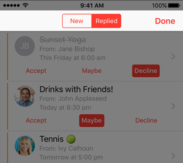
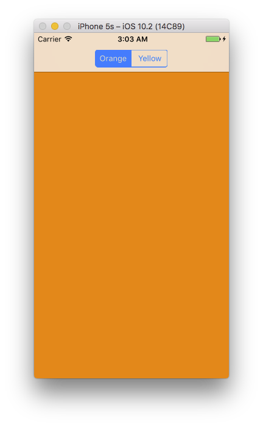

+++
title = "Building a SegmentedViewController"
description = "Walkthrough of buliding a SegementedViewController."
date = 2016-12-16T10:43:02-08:00
updated = 2016-12-16T10:43:02-08:00
draft = false
template = "blog/page.html"
author = "Drew De Ponte"
+++

Let's say you run into a scenario where you need to build a mobile interface that has tabs at the top of the screen. If you are working on Android this isn't too much of a problem as it is natively supported and part of their [Material Design](https://material.io/guidelines/components/tabs.html). If you are building an iOS app it is a bit of a different story as the native `UITabBarController` doesn't really work at the top of the screen. Yes, there are some nasty things you can do to hack it. But, we really shouldn't be hacking things, should we? If we want to not run into crazy issues later and continue the hack, we should generally use the framework and systems as they were designed to be used.

If we dig into Apple's [iOS Human Interface Guidelines](https://developer.apple.com/ios/human-interface-guidelines/overview/design-principles/)
the closest thing I can find to tabs at the top of the screen is in the [UI Bars -> Navigation Bars](https://developer.apple.com/ios/human-interface-guidelines/ui-bars/navigation-bars/) section.



Looking through the images you will find the image above and an explanation suggesting that you use `UISegmentedControl` in the navigation bar at the top to help flatten your information hierarchy.

So, how do we actually make something like this happen?

It turns out that constructing an instance of a `UISegmentedControl`, injecting it into the `UiNavigationBar`, and getting callbacks when the various segments are selected is pretty straight forward.

```swift
var segmentedControl = UISegmentedControl(items: ["New", "Replied"])
segmentedControl?.selectedSegmentIndex = 0
segmentedControl?.addTarget(self, action: #selector(segmentSelected), for: .valueChanged)
yourViewController.navigationItem.titleView = segmentedControl
```

The above constructs a `UISegmentedControl` with two segements, **New**, and **Replied**. It also selects **New**. *Note:* This is only a visual indication it doesn't trigger any callbacks. Then we call `addTarget` to register an action to be called when the value of the segmented control changes. This is the spiked ground work for most of the components necessary. However, there is a lot more involved to have the `UISegmentedControl` trigger changing the views.

The intended approach for this is to use a concept Apple created called a [Container View Controller][container-view-controller]. These are basically responsible for owning and managing a collection of view controllers and their associated views. Prime examples of these are `UITabBarController` and `UINavigationController`. Turns out none of the existing [Container Controllers][container-view-controller] do what we want. So, we will have to [Implement a Container View Controller][implement-a-container-view-controller] of our own that takes care of owning/managing the `UISegmentedControl`, the parenting view,and managing a collection of View Controllers and their paired Views that are coupled to each segment of the `UISegmentedControl`.

## Walk Through

Given that we now have an understanding of the core components and concepts. Lets walk through implementing a rough initial version of our custom container view controller.

Let's start by creating a class that inherits from `UIViewController` called `SegmentedViewController`.

```swift
import UIKit

open class SegmentedViewController: UIViewController {
}
```

Now we know that the `SegmentedViewController` needs to manage a collection of view controllers as well as a segmented control. So, let's create stored properties for both of those.

```swift
import UIKit

open class SegmentedViewController: UIViewController {
    open var segmentViewControllers: [UIViewController] = []
    open var segmentedControl: UISegmentedControl?
}
```

Now that we have properties to hold the managed values we need to initialize them. We do this by defining a constructor that takes `viewControllers: [UIViewController]` and assigns them to our stored property `self.segmentViewControllers`. *Note:* We also have to define the required constructor enforced by `UIViewController`. However, we don't want to support compilation via that mechanism so we have it fatal error out.

```swift
import UIKit

open class SegmentedViewController: UIViewController {
    open var segmentViewControllers: [UIViewController] = []
    open var segmentedControl: UISegmentedControl?

    public init(_ viewControllers: [UIViewController]) {
        super.init(nibName: nil, bundle: nil)
        self.segmentViewControllers = viewControllers
    }

    public required init(coder aDecoder: NSCoder) {
        fatalError("init(coder:) has not been implemented")
    }
}
```

Given that we can now have an object that knows about a collection of view controllers to manage, we need to use those to set up our other stored property, the `UISegmentedControl`. We can do this by using the standard `viewDidLoad` method of the `UIViewController` and defining a couple more methods.

```swift
import UIKit

open class SegmentedViewController: UIViewController {
    open var segmentViewControllers: [UIViewController] = []
    open var segmentedControl: UISegmentedControl?

    public init(_ viewControllers: [UIViewController]) {
        super.init(nibName: nil, bundle: nil)
        self.segmentViewControllers = viewControllers
    }

    public required init(coder aDecoder: NSCoder) {
        fatalError("init(coder:) has not been implemented")
    }

    open override func viewDidLoad() {
        super.viewDidLoad()

        self.segmentedControl = UISegmentedControl(items: segmentTitles())
        self.segmentedControl?.selectedSegmentIndex = 0
        self.segmentedControl?.addTarget(self, action: #selector(segmentSelected), for: .valueChanged)

        self.navigationItem.titleView = self.segmentedControl
    }

    fileprivate func segmentTitles() -> [String] {
        var segmentTitles: [String] = []
        for viewController in self.segmentViewControllers {
            if let title = viewController.title {
                segmentTitles.append(title)
            }
        }
        return segmentTitles
    }

    open func segmentSelected(_ segmentControl: UISegmentedControl) {
    }
}
```

In the above, we added in some of the basic ground work that we covered at the beginning of the article. Specifically, we constructed the `UISegemntedControl` and assigned it to our stored property, `self.segementedControl`. We marked the first segment as the active one, visually, and we added a target called `segmentSelected` when the value of the segmented control changes. The `segmentTitles` method is a simply helper method that extracts the standard `title` property from the injected view controllers. This allows us to easily use them when constructing the `UISegmentedControl`.

Now we need to add the ability for it to display the first view controller, as we already configured the `self.segmentedControl` telling it that the first one is selected.

```swift
import UIKit

open class SegmentedViewController: UIViewController {
    open var segmentViewControllers: [UIViewController] = []
    open var segmentedControl: UISegmentedControl?

    public init(_ viewControllers: [UIViewController]) {
        super.init(nibName: nil, bundle: nil)
        self.segmentViewControllers = viewControllers
    }

    public required init(coder aDecoder: NSCoder) {
        fatalError("init(coder:) has not been implemented")
    }

    open override func viewDidLoad() {
        super.viewDidLoad()

        self.segmentedControl = UISegmentedControl(items: segmentTitles())
        self.segmentedControl?.selectedSegmentIndex = 0
        self.segmentedControl?.addTarget(self, action: #selector(segmentSelected), for: .valueChanged)
        displaySegmentViewController(0)

        self.navigationItem.titleView = self.segmentedControl
    }

    fileprivate func segmentTitles() -> [String] {
        var segmentTitles: [String] = []
        for viewController in self.segmentViewControllers {
            if let title = viewController.title {
                segmentTitles.append(title)
            }
        }
        return segmentTitles
    }

    open func segmentSelected(_ segmentControl: UISegmentedControl) {
    }

    fileprivate func displaySegmentViewController(_ segmentViewControllerIndex: Int) {
        let viewController = self.segmentViewControllers[segmentViewControllerIndex]

        self.addChildViewController(viewController)

        self.view.addSubview(viewController.view)

        viewController.view.translatesAutoresizingMaskIntoConstraints = false

        NSLayoutConstraint(item: viewController.view, attribute: .left, relatedBy: .equal, toItem: self.view, attribute: .left, multiplier: 1.0, constant: 0.0).isActive = true
        NSLayoutConstraint(item: viewController.view, attribute: .right, relatedBy: .equal, toItem: self.view, attribute: .right, multiplier: 1.0, constant: 0.0).isActive = true
        NSLayoutConstraint(item: viewController.view, attribute: .top, relatedBy: .equal, toItem: self.view, attribute: .top, multiplier: 1.0, constant: 0.0).isActive = true
        NSLayoutConstraint(item: viewController.view, attribute: .bottom, relatedBy: .equal, toItem: self.view, attribute: .bottom, multiplier: 1.0, constant: 0.0).isActive = true

        viewController.didMove(toParentViewController: self)
    }
}
```

In order to accomplish this, we added a `displaySegmentViewController` method that given a `segmentViewControllerIndex` appropriately displays and manages the lifecycle of the child view controller and its view.

Now we need to add support so that when a segement is selected it appropriately displays the selected segment's view and hides the previously selected segment's view.

```swift
import UIKit

open class SegmentedViewController: UIViewController {
    open var segmentViewControllers: [UIViewController] = []
    open var segmentedControl: UISegmentedControl?

    fileprivate var lastDisplayedSegmentViewControllerIndex: Int?

    public init(_ viewControllers: [UIViewController]) {
        super.init(nibName: nil, bundle: nil)
        self.segmentViewControllers = viewControllers
    }

    public required init(coder aDecoder: NSCoder) {
        fatalError("init(coder:) has not been implemented")
    }

    open override func viewDidLoad() {
        super.viewDidLoad()

        self.segmentedControl = UISegmentedControl(items: segmentTitles())
        self.segmentedControl?.selectedSegmentIndex = 0
        self.segmentedControl?.addTarget(self, action: #selector(segmentSelected), for: .valueChanged)
        displaySegmentViewController(0)

        self.navigationItem.titleView = self.segmentedControl
    }

    fileprivate func segmentTitles() -> [String] {
        var segmentTitles: [String] = []
        for viewController in self.segmentViewControllers {
            if let title = viewController.title {
                segmentTitles.append(title)
            }
        }
        return segmentTitles
    }

    open func segmentSelected(_ segmentControl: UISegmentedControl) {
        var lastDisplayedIndex: Int? = nil

        if let i = self.lastDisplayedSegmentViewControllerIndex {
            lastDisplayedIndex = i
        }

        displaySegmentViewController(segmentControl.selectedSegmentIndex)

        if let j = lastDisplayedIndex {
            hideSegmentViewController(j)
        }
    }

    fileprivate func displaySegmentViewController(_ segmentViewControllerIndex: Int) {
        let viewController = self.segmentViewControllers[segmentViewControllerIndex]

        self.addChildViewController(viewController)

        self.view.addSubview(viewController.view)

        viewController.view.translatesAutoresizingMaskIntoConstraints = false

        NSLayoutConstraint(item: viewController.view, attribute: .left, relatedBy: .equal, toItem: self.view, attribute: .left, multiplier: 1.0, constant: 0.0).isActive = true
        NSLayoutConstraint(item: viewController.view, attribute: .right, relatedBy: .equal, toItem: self.view, attribute: .right, multiplier: 1.0, constant: 0.0).isActive = true
        NSLayoutConstraint(item: viewController.view, attribute: .top, relatedBy: .equal, toItem: self.view, attribute: .top, multiplier: 1.0, constant: 0.0).isActive = true
        NSLayoutConstraint(item: viewController.view, attribute: .bottom, relatedBy: .equal, toItem: self.view, attribute: .bottom, multiplier: 1.0, constant: 0.0).isActive = true

        viewController.didMove(toParentViewController: self)

        self.lastDisplayedSegmentViewControllerIndex = segmentedControl?.selectedSegmentIndex
    }

    fileprivate func hideSegmentViewController(_ segmentViewControllerIndex: Int) {
        let viewController = self.segmentViewControllers[segmentViewControllerIndex]

        viewController.willMove(toParentViewController: nil)
        viewController.view.removeFromSuperview()
        viewController.removeFromParentViewController()
    }
}
```

To do this we added a fileprivate stored property called `lastDisplayedSegmentViewControllerIndex` to track the previously selected segment. This was useful when we fleshed out the `segmentSelected` method. We also updated the `displaySegmentViewController` method to update `lastDisplayedSegmentViewControllerIndex` with a new index after it has displayed the segment's view. The details on the required lifecycle management of the child view controllers that we implemented in the `displaySegementViewController` and `hideSegmentViewConroller` were provided in [Implement a Container View Controller][implement-a-container-view-controller].

This completes our initial implementation of our `SegmentedViewController`.

## Usage

Let's look at how we would use this thing now. The following is a simple `AppDelegate` that would use the `SegemntedViewController`.


```swift
import UIKit

@UIApplicationMain
class AppDelegate: UIResponder, UIApplicationDelegate {

    var window: UIWindow? = UIWindow(frame: UIScreen.main.bounds)

    func application(_ application: UIApplication, didFinishLaunchingWithOptions launchOptions: [UIApplicationLaunchOptionsKey: Any]?) -> Bool {

        let vcOrange = UIViewController()
        vcOrange.title = "Orange"
        vcOrange.view.backgroundColor = .orange

        let vcYellow = UIViewController()
        vcYellow.title = "Yellow"
        vcYellow.view.backgroundColor = .yellow

        let segmentedViewController = SegmentedViewController([vcOrange, vcYellow])

        window!.rootViewController = UINavigationController(rootViewController: segmentedViewController)
        window!.makeKeyAndVisible()

        return true
    }
}
```



## That's It

All in all it isn't too bad. I hope you found this valuable and if you have any questions don't hesitate to contact me. This is just a little more complex than I would want to have to deal with in an app code base. So, I will probably break this out into a framework soon.

[container-view-controller]: https://developer.apple.com/library/content/featuredarticles/ViewControllerPGforiPhoneOS/index.html#//apple_ref/doc/uid/TP40007457-CH2-SW1
[implement-a-container-view-controller]: https://developer.apple.com/library/content/featuredarticles/ViewControllerPGforiPhoneOS/ImplementingaContainerViewController.html#//apple_ref/doc/uid/TP40007457-CH11-SW1
