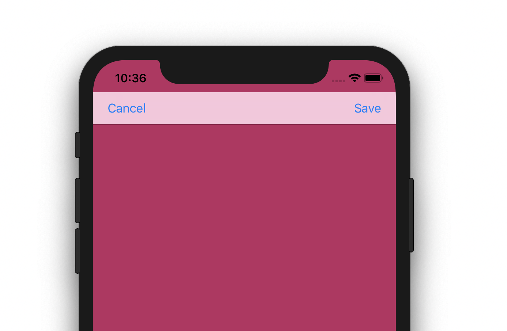
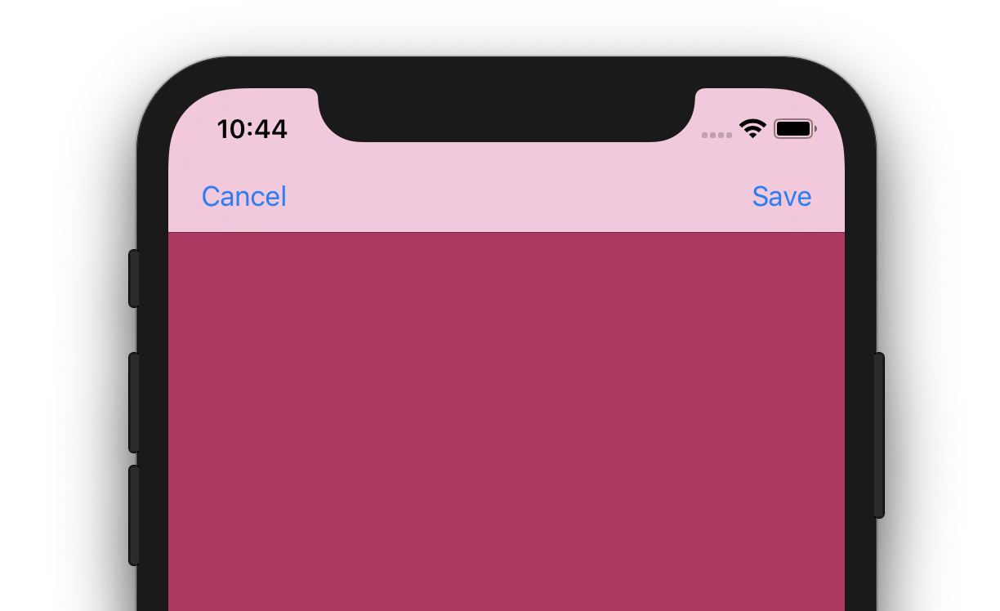

+++
title = "Navigation Bar Behind Status Bar"
description = "How to extend the UINavigationBar behind the status bar in your iOS app"
date = 2018-12-20T00:00:00+00:00
updated = 2018-12-20T00:00:00+00:00
draft = false
template = "blog/page.html"
author = "Ryan Hedges"
+++

You might find yourself in an situation where you want to use the
`UINavigationBar` API to create a navigation bar in one of your views. But it
doesn't look quite right. It doesn't extend up behind the status bar like you've
seen it do countless times before when using a `UINavigationController`. What
gives? How do you extend the navigation bar behind the status bar in your iOS
app?



## Solution

The solution is actually really simple to implement, but how to do it using swift
may prove to be more challenging to find online.

All you need to do is extend an object, like your view controller, to conform to the `UINavigationBarDelegate` and implement `position(for:)` to return `UIBarPosition.topAttached`

```swift
class SomeViewController: UIViewController {

    private let navigationBarView: UINavigationBar = {
        let nav = UINavigationBar(frame: .zero)
        // Configure navigation bar...
        return nav
    }()

    override func viewDidLoad() {
        super.viewDidLoad()
        view.backgroundColor = UIColor.init(red: 187/255, green: 42/255, blue: 97/255, alpha: 100)

        // Assign your delegate object
        self.navigationBarView.delegate = self

        let navBar = navigationBarView
        view.addSubview(navBar)

        navBar.translatesAutoresizingMaskIntoConstraints = false
        navBar.leadingAnchor.constraint(equalTo: view.leadingAnchor).isActive = true
        navBar.trailingAnchor.constraint(equalTo: view.trailingAnchor).isActive = true
        navBar.topAnchor.constraint(equalTo: view.safeAreaLayoutGuide.topAnchor).isActive = true

        // Any other view needs
    }
}

extension SomeViewController: UINavigationBarDelegate {
    func position(for bar: UIBarPositioning) -> UIBarPosition {
        return UIBarPosition.topAttached
    }
}
```



Please note, you may want to handle the delegate function more gracefully depending on your needs.

```swift
extension SomeViewController: UINavigationBarDelegate {
    func position(for bar: UIBarPositioning) -> UIBarPosition {
        guard self.navigationBarView == bar as? UINavigationBar else {
            return bar.barPosition
        }
        return UIBarPosition.topAttached
    }
}
```


Hopefully this helps you continue creating a `UINavigationBar` with the look and
feel that you want for your application.

### Sample Project
If you want to see it in action and play with it yourself, you can download the
sample project from our [sample projects repo on
GitHub](https://github.com/uptech/sample_projects/tree/master/ios/uinavigationbar-under-statusbar).

If you have any comments or questions about this post or the sample project
please feel free to [email us](mailto:info@upte.ch) or submit a [new github
issue](https://github.com/uptech/sample_projects/issues/new). We'd love to hear
from you!

