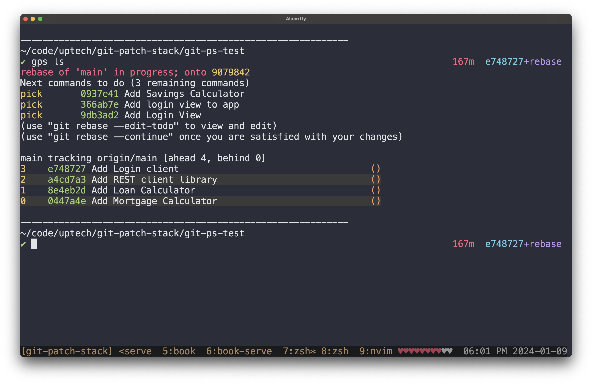

+++
title = "Git Patch Stack 7.0.0"
description = "A deep dive about the 7.0.0 release of Git Patch Stack and how it differs from previous versions."
date=2024-01-09
draft = false
template = "blog/page.html"

[extra]
authors = ["drewdeponte"]
thumbnail = "/img/posts/thumbnails/logo-git.png"
canonical = "https://drewdeponte.com/blog/git-patch-stack-7-0-0/"
+++

The `7.0.0` release of Git Patch Stack is an extremely significant release. It
marks the beginning of a few major mental & strategic shifts in terms of Git
Patch Stack.

## State

Historically we have tracked state in all versions of Git Patch Stack before
`7.0.0`. We stored this state in `.git/GIT-PATCH-STACK-PATCH-STATES-V3.json`,
and a state entry in it generally would look something like the following.

```json
{
  "5543c1e7-b77b-41af-8653-c721b2e9db9d": {
    "patch_id": "5543c1e7-b77b-41af-8653-c721b2e9db9d",
    "state": {
      "Integrated": [
        "origin",
        "ps/rr/fix_grammar___spelling_in_making_code_reusable",
        "4c4b3b720b92957b21f11a9b6a331190b55535b1"
      ]
    }
  },
}
```

You can conceptually think of it as hash map keyed off of the `ps-id`
(`patch_id`). The `state` property is simply an object that kept track of
the current state of a given patch.

This `state` property could conceptually be in any of the following cases,
each with their own associated data.

```rust
#[derive(Serialize, Deserialize, Debug, Clone)]
pub enum PatchState {
    BranchCreated(String, String), // branch_name, patch_stack_diff_hash
    PushedToRemote(String, String, String, String), // remote, branch_name, patch_stack_diff_hash, remote_diff_hash
    RequestedReview(String, String, String, String), // remote, branch_name, patch_stack_diff_hash, remote_diff_hash
    Integrated(String, String, String),              // remote, branch_name, patch_stack_diff_hash
}
```

This was a simple straightforward way of getting started with Git Patch Stack
and representing the state that we believed we needed. However, over time we
began to see flaws & drawbacks with this approach.

### Flaws

For one, we got numerous reports of the state tracking becoming out of
alignment with Git proper because users were going outside of Git Patch Stack
and doing things.

Additionally, Git Patch Stack was tracking state that was fabricated. Meaning
it was state that we had made up and wasn't actually possible to represent
within Git. This is largely because we were caching this fabricated state from
remote systems such as GitHub. Creating another point/opportunity to be out of
sync in terms of state.

Third, people were trying to use Git Patch Stack across multiple remotes of a
repository and our state tracking had no mechanism of being synchronized across
the remotes.

### The Decision

With the `7.0.0` release we decided to resolve these issues by making a very
important decision. Firstly, we would **no longer track state**. Instead, we
would **compute the state** for Git Patch Stack from the natural state of Git.

This has the benefit that it makes it impossible for a users Git state to be out of
sync with a users Git Patch Stack state.

Beyond that, it facilitates the sharing of Git Patch Stack state across remotes
as the Git state is already synchronized over the network.

In addition, it has the massive benefit of now enabling users to use only the
portions of Git Patch Stack that they find valuable for their workflow without
getting out of sync. This same characteristic also enables Git Patch Stack to
be combined with other Git extensions & tools (e.g.
[git-absorb](https://github.com/tummychow/git-absorb)) without worrying about
getting out of sync.

### Beneficial Side Effects

In addition to all the natural benefits we have gained from the decision to
compute state instead of track state, we indirectly gained a massive side
effect. The side effect of creating better alignment between Git Patch Stack
and Git proper. This modeling alignment ended up enabling us to add a long
requested feature of Git Patch Stack, Patch Series support. 

A Patch Series within a Patch Stack workflow is a defined consecutive sequence
of patches. Often times they are dependent on one another and have to be
sequenced in a specific order. This is useful when you want to simply organize
related patches or when you want to request review of a series of patches.


Even though we have introduced the concept of a patch series, it is important
to realize that they still exist within your Patch Stack. In fact, they can
exist alongside other solo patches or other patch series within your stack.
Their relationship to each other is simply controlled by which order you place
them in your stack. The same way that you manage patch relationships.

To understand how we define or refine a patch series lets look at the example above. Prior to having the "login" patch series defined our `gps ls` output would look as follows.


Simply a stack of patches. To define or refine a patch series we simply use our new patch index range syntax (e.g. `2-5`), which works generally across the commands. For example if we want to create the patch series locally like we did in this example we would use `gps branch -n login 2-5`. Leaving us with a `gps ls` output that again looks as follows.


However, if we wanted to refine the definition of that patch series. We would
simply rerun that same command while either increasing or decreasing the patch
index range to respectively include or exclude patches from the patch series.

#### Alternating Patch Series Coloring

After using Patch Series support for a while within the Git Patch Stack core
team, we decided that to really make it easy to use we would need to be able to
visually see a patch series within the stack without having to track from the
right side of a patch, seeing the branch, all the way over to the left side of
the patch to see the index. Our solution for this problem was relatively
simple. We introduced alternating patch series colors in the `gps list` output.

This allows you to clearly see which patches are part of which patch series.


In fact from the screenshot above you can see that `gps list` sees individual
patches that are not part of a formal patch series as implicit patch series of
one patch. This is why the colors are alternating between the `Add Mortgage
Calculator` patch and the `Add Loan Calculator` patch, as well as the `Add
Savings Calculator` patch.

In fact if we had the same set of patches but hadn't defined the patch series
we would see the following, as the alternate patch series coloring feature is
enabled by default.


We can also clearly see the every patch in the list has alternate coloring.
This is a side effect of the fact that we don't have any formal patch series
defined and again that `gps list` sees solo patches as a patch series of one
patch.

##### Colors and their Problems

Colors especially within the terminal have a number of different problems. For
one the contrast needed for different people is different. Two, the colors
within my terminal are almost always different from the colors in your
terminal. Not to mention how your monitor is configured and presents the colors
to you is likely different. Or even, how your eyes interpret the colors and
the variance there. Who knows maybe you are color-blind and therefore need
specific colors.

To address these issues we have shifted to 24-bit color mode and set the
default colors based on my personal color choices. This way the colors are
hopefully pretty close to the colors I use on my machine.

We have also opted to support customization of the colors so that if you need
or just want different colors you can configure the colors that are used in the
`gps list` output. For details check out the
[Configuration](https://book.git-ps.sh/tool/configuration) documentation.

## Composition over Opinion

Another characteristic that Git Patch Stack has had historically up until
`7.0.0` is that it was more opinionated. It expected users to follow a specific
workflow and focused primarily on that.

This original decision was largely due to the fact that we were tracking state
and therefore users had to use our commands & workflow for the tool to
consistently work.

As part of the original approach we implemented a decent number of commands
either for convenience, as an alias, or to try and create a complete
abstraction to facilitate having a workflow completely within Git Patch Stack.
A lot of these commands actually did nothing other than proxy down to a Git
command. This has its maintenance problems as we would then have to maintain
and proxy all the various options for that Git command.

Git commands change over time and therefore this creates a large maintenance
problem. Beyond that it turns out that there are a ton of different variations
of workflows that users have with Git. Having a hard lined view of the workflow
that Git Patch Stack is targeted to support and not supporting any other
workflows significantly limits its ability to be valuable.

However, now that we are computing state we no longer need to be so opinionated
in terms of workflow as our users can now use the pieces of Git Patch Stack
they prefer and ignore the rest. They can also use Git Patch Stack in
combination with other Git commands or even other Git extensions.

So we decided to change the focus of Git Patch Stack from enforcing a
particular workflow, to instead be a general tool allowing users to have their
own custom workflows utilizing Git Patch Stack.

Making this decision then made it clear that to truly support this mindset we
should remove all the "proxy commands". This will ease our maintenance effort
significantly, and it will make the intention of Git Patch Stack and its stance
clearer. So we removed the `sync`, `log`, `create-patch`, `amend-patch`,
`status`, `unstage`, `upstream-patches`, and the `add` commands to simplify the
command surface area.

To continue this effort to simplify the command surface area we removed the
`batch-request-review` command and added proper first class support for
batching to the `request-review` command. When doing so, we added it in a way
that would be easy to add to other commands. However, we were hesitant to just
add it to all the commands as we weren't sure that it made sense. Additionally,
we removed the old `branch` command and renamed the `request-review-branch`
command to `branch` as well as retrofitted it to be a first class citizen.

We also realized, based on proxy command feature requests, that we needed to
somehow support all these custom local Git workflows people have. We decided
that the best way to do this was to additionally focus Git Patch Stack on the
concept of facilitating composition of its concepts with that of Git proper or
any other command line tool for that matter.

To begin to facilitate this we have provided the `gps sha <patch-index>`
command. It simply takes a `patch-index` as the argument and outputs the
corresponding Git commit SHA. Having this basic command now allows people to
build new commands that deal with a patch index instead of a Git commit SHA.

Maybe you are a fan of using `git commit --fixup` and you want to use it with a
patch index instead of having to have the SHA for a patch and type it in. No
problem with `gps sha` you can simply do `git commit --fixup=amend:$(gps sha
4)` to flag patch indexed by 4 for amend. If it is a command you use all the
time in your workflow simply make an alias that does it.

This flexibility provided by the composition is key to support the vast variety
of personalized workflows that people have.

## Platform Agnostic

Another choice that we made was that we should be as platform-agnostic as
possible in our choices and our design so that we can support as many platforms
as possible. Support for macOS & Linux variants was something we had at a basic
level. However, Windows was a platform that we didn't support primarily because
of choices of libraries we used.

So part of the effort of the `7.0.0` release was to move toward being able to
support the Windows platform. As I mentioned before the primary issue we had
was libraries we were using that weren't cross-platform. So we swapped those
out for libraries that were cross-platform.

### GPG Signing

The other major issue we had was GPG signing support. Prior to `7.0.0` we were
integrating directly with GPG via C library that we couldn't easily get to
build on Windows. So we decided to follow suite with what Git proper was doing
in terms of GPG Signing support and have Git Patch Stack simply shell out to
the GPG command on that system by utilizing Git propers configuration.

For details on configuring GPG signing please checkout [Commit Signing](https://book.git-ps.sh/tool/commit-signing) docs.

### SSH Signing

In addition to switching GPG Signing away from the C library. We also had
numerous requests to support SSH Signing as GPG was losing in popularity. So
while we were reworking the GPG Signing we also added support for SSH
Signing in a cross-platform manner. 

All of these platform-agnostic choices have also resulted in a far simpler
build process which helps not only in the distribution of the application but
also in the maintenance and even developer onboarding.

For details on configuring SSH signing please checkout [Commit Signing](https://book.git-ps.sh/tool/commit-signing) docs.

## Quality of Life

Beyond these major decisions and the improvements that have fallen out of them
we also have a lot of improvements that we have made simply for Quality of
Life.

### Integrate Verify Hook

As part of `7.0.0` we now have the `integrate_verify` hook. This is a hook that
gets executed as part of the `gps integrate` commands lifecycle. Enabling you
to verify external state, maybe on an SCM hosting provider, is correct prior to
integrating.

We have provided an example in the repository,
[example_hooks/integrate_verify.sample.github-cli](https://github.com/uptech/git-ps-rs/blob/main/example_hooks/integrate_verify.sample.github-cli).
This example is written to integrate with GitHub to check to make sure that all
the CI checks have passed prior to letting someone integrate their patch.

For further details on this hook check out the [Hooks](https://book.git-ps.sh/tool/hooks) documentation.

### In Rebase Support

For quite some time we have had requests to make `gps list` function when in
the middle of a rebase. Well `7.0.0` is the release where we finally add
support for this. To see how this works let's get started by setting the state
to what you see in the screenshot below.


Now let's say that we want to edit the `Add Login client` patch identified by
patch index `3`. One approch to doing that is to run a `gps rebase` and simply
mark that patch for `edit`. This will leave us looking like the following.


Git simply outputs the short SHA and summary of the commit it stopped at for
editing. However, if we now run `gps list` we see the following.



From the above we can see that it shows us a lot more useful information here.
It shows us that we are in the middle of a rebase of `main` and the SHA of the
commit we are rebasing it onto.

It also shows us in the bottom section the current state of the patch stack. At
this point in time it only consists of the patches that the rebase has already
played. From this we can tell that if we were to run a `git commit --amend` it
would be amending the `Add Login client` patch as it is the patch currently at
the top of the stack.

Lastly the section above that shows the patches that are still in the rebase
to-do list and have yet to be replayed. In fact if you squint a little you
might have noticed that if you slammed the top section and bottom section
together it would look just like your patch stack. This is by design so that
you can quickly and easily figure out what state you are in with respect to
your patch stack, even when you are in the middle of a rebase `gps list`.

### Ahead & Behind Counts

In addition to all these other great improvements we also improved `gps list`
by adding **ahead** and **behind** counts to its output. In fact we can see
these on the top line of the `gps list` output in the screenshot below.


In the screenshot above we can see that it says that we are currently in a
state where our patch stack is `ahead 7` and `behind 0`. What does this mean
exactly?

Well, `ahead X` is telling you how many patches stack has ahead of it's base.
In the screenshot above it is `7` because there are `7` patches.

The `behind Y` is telling you how many commits your stack is behind it's
associated upstream tracking branch. You generally want it to be `0` as that
indicates that your patch stack is up-to-date with what Git sees as the current
state of your patch stacks upstream tracking branch. You will notice becoming
behind if others are adding commits to the remote of your patch stack, and you
are using `git fetch` to update your repositories' knowledge, but you aren't
actively rebasing your patch stack onto the latest.

### Others

Beyond all the above-mentioned features & changes. We have also included a
handful of other changes that are less crucial and less visible in terms of
presentation. The summary of these can be seen below.

#### Added

- conflict & merge commit detection errors to isolate command
- conflict & merge commit detection errors to branch command
- conflict & merge commit detection errors to request-review command
- conflict & merge commit detection errors to integrate command
- global color option support to the branch command
- the command alias "b" to the new branch command
- build time generation of man pages

#### Changed

- unhandled error output for the list command
- unhandled error printing to print the chain of errors
- gps --help docs to describe core vs. ancillary cmds
- improved CLI help interface

#### Fixed

- crash in list command when tracking branch is configured but remote branch doesn't exist
- bug where commit without diff id in stack would cause list to fail

## Where to Go from here?

The future is somewhat an unknown as we haven't planned a next major release
yet, let alone a theme for one. To keep tabs on what we are planning or
specific issues you can check out our public [GitHub
Project](https://github.com/orgs/uptech/projects/3).

If you are interested in chatting about Git Patch Stack or just different Git
workflows, providing feedback, or contributing. Don't hesitate to reach out via
our public [Slack
Group](https://join.slack.com/t/gitpatchstack/shared_invite/zt-1bubjt6wg-QrvG9aBGniyZ0aPH9BcB4g).

If you are completely new to Git Patch Stack, a good place to start would be
the main [Git Patch Stack site](https://git-ps.sh) as well as the
[documentation](https://book.git-ps.sh).

As always we hope that you find the decisions, changes and features we added
valuable.


