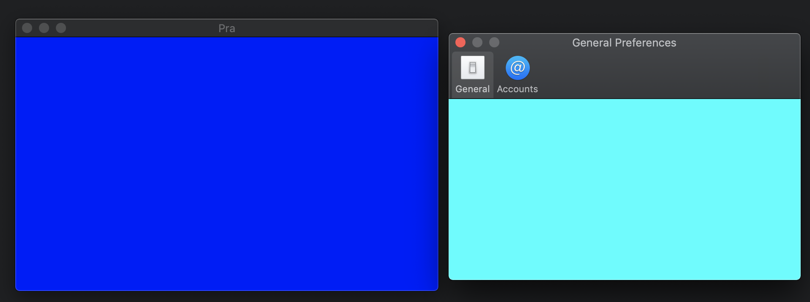
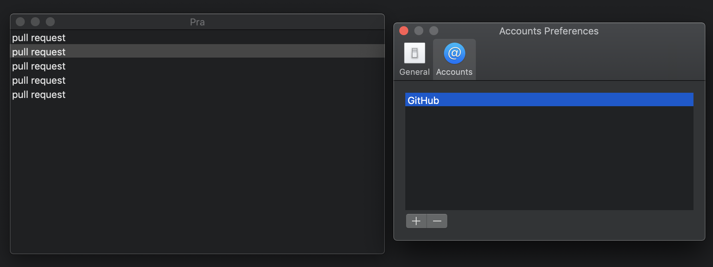
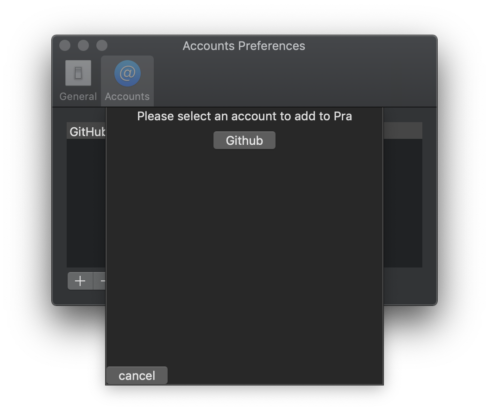
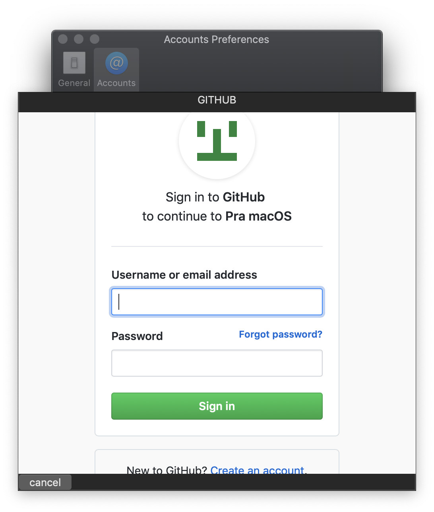
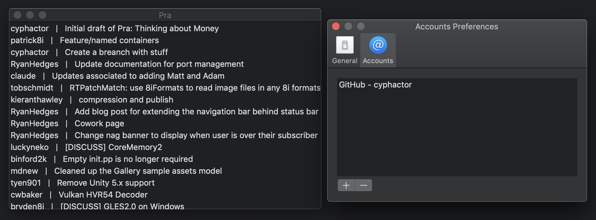
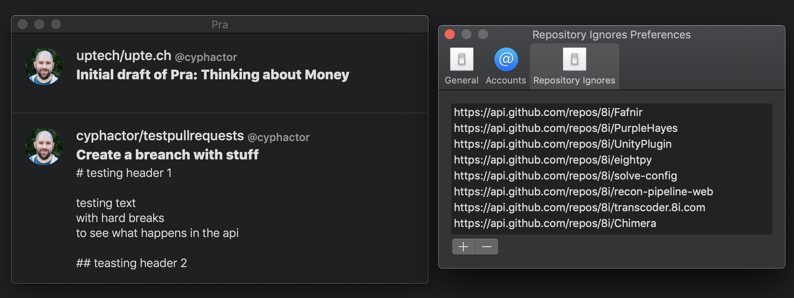
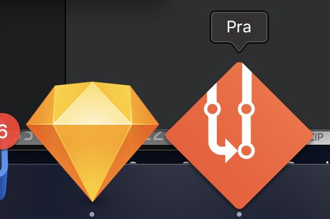
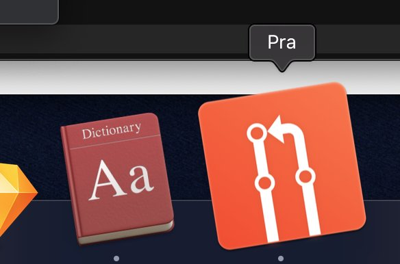
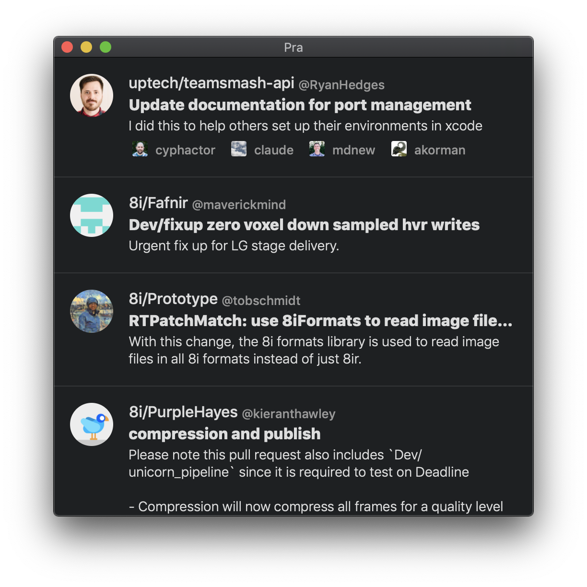
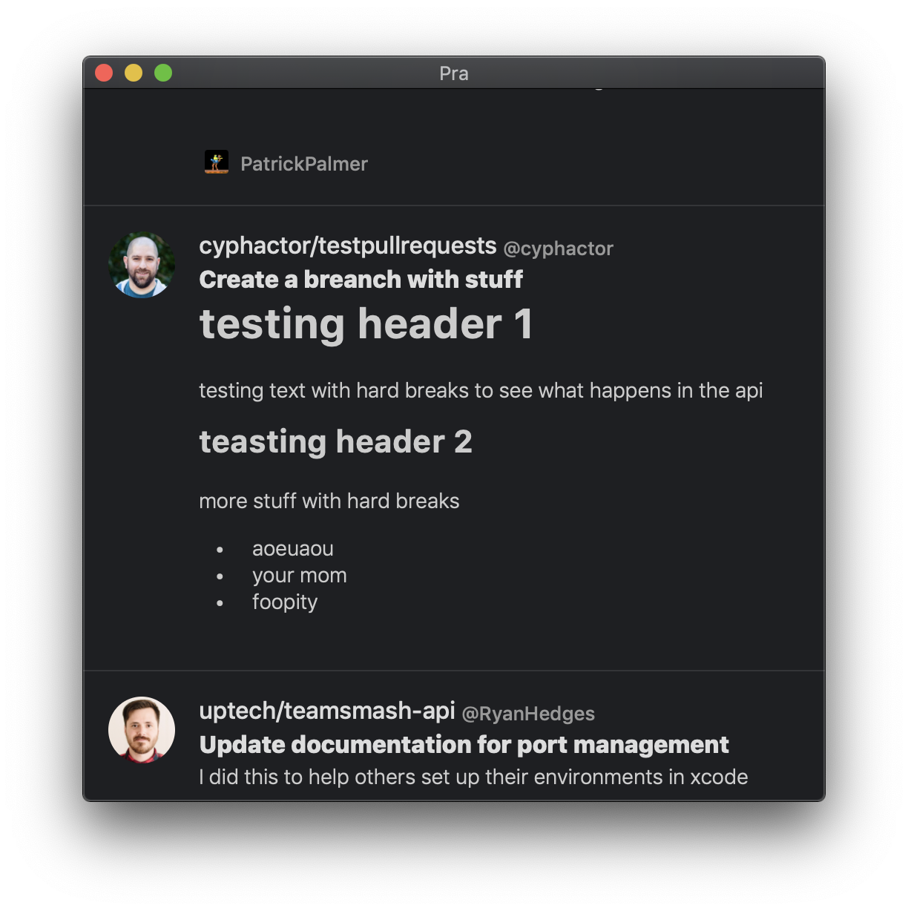

+++
title = "Pra: Status Update 001"
date = 2019-01-07T09:32:01-08:00
updated = 2019-01-07T09:32:01-08:00
draft = false
template = "blog/page.html"
author = "Drew De Ponte"
+++

This is the first status update of the Pra macOS application. I figured what better time to do this than right after 2018 ends and 2019 begins. My goal with this is to give you an idea of where I am with the development, give you some insight into the things I am doing and some of the decisions I am making along the way. If you would like a more real-time feed of what is happening and want to provide feedback you can always follow me on Twitter [@drewdeponte](https://twitter.com/drewdeponte).

## Initial Setup
The first step I took with this application was to start a basic macOS application. Immediately following that I:

- replaced all the Interface Builder xib stuff with straight up source code because I prefer to develop apps without Interface Builder or xibs
- built out the Main Menu, Main Window, Preferences Window, and the Preferences Window’s tab interface
- built out the Account Management Interface
- built out Main Window for Pull Request list

Building out the basic skeleton of App in terms of flow is part of the outside-in approach I like to take when developing applications.

## Making Account Management Real
Once I had the skeleton of the macOS App together in terms of windows, etc. It was time to make adding GitHub accounts and the persistence of them and their associated API keys a thing. I also built out a very basic stubbed out pull request list view in the main window as I knew that the next step would be to actually add fetching and displaying of pull requests.

*Note:* I decided to implement GitHub integration initially because it is what I primarily use and I believe it has the largest user base.

## Making Pull Requests Real
After adding basic Account Management I proceeded to drive toward making it so the App could fetch, present, and support basic interaction with Pull Requests. My goal with this phase of development was to get the minimal aggregation functional, interaction and UI implemented so that we could try it out and see if we felt it was functional at all in this rough state.

So, I implemented the following:

- Fetching & aggregating Pull Requests from accounts
- Scheduling of Pull Requests refresh at 5 mins
- Open Pull Request by double clicking
- Refresh Pull Requests on account addition/removal so user doesn’t have to wait ~5 mins after adding an account to see their PRs

## Making Things Functional - Round 1
At this point I distributed it to [Ryan](https://twitter.com/Ryan_Hedges), [Matt](https://www.linkedin.com/in/mdnew/), [Adam](https://twitter.com/adamkorman), and [Claude](https://twitter.com/cciocan) so they could start running it to see how functional/useful it was at this point. We decided that it was functional, supporting our theory that we believe there is value in this App. However, there were some immediate things that we thought would make it easily more valuable. So, I added:

- Displaying Repository name into the pull request list
- Ability to ignore Pull Requests from repositories by right clicking on a pull request and selecting _ignore repository_.
- Adding organization, description & avatar to Pull Request list - *Note:* I did this without caching of avatar images, etc. so that I could get feedback quicker, with and with less investment.

##  Some Polish - Round 1
I sent the latest build to [Ryan](https://twitter.com/Ryan_Hedges), [Matt](https://www.linkedin.com/in/mdnew/), [Adam](https://twitter.com/adamkorman), and [Claude](https://twitter.com/cciocan) and we started using it again. After a day or so of use the feedback was pretty unanimous. The added features aided significantly and we felt we were on the right path.  However, we did identify a number of small things that just didn’t make it feel polished enough or didn’t make it feel like a real product. I like to tackle these types of issues as I develop an application for two main reasons.

- it is a pain to have to worry about them all at the end
- it is hard sometimes to not have feedback swayed by some of these polish things

This lead me to start designing an icon for the App. It is weird how much of mental game not having an icon for your App is. But, once you have one (even if it isn’t the greatest final version) it does a huge amount to make you feel like you are moving forward and that your app is becoming a real thing. So, I designed the first draft of the icon. I took ideas from both the Pull Request Icon that GitHub uses and the Git logo, threw them in a blender and came up with the following to get started.

I also added Microsoft App Center integration for Analytics Tracking and Crash reporting. These are crucial as a feedback mechanism as I distribute the app internally and as I prepare to distribute the free version publicly.

Beyond that, I made cut, copy, paste, undo & redo work. This was especially important in the OAuth WebView because when you would try to fill out the OAuth form you were not able to paste your password from a password manager. Extremely annoying to say the least. So I had to fix that one.

[Adam Korman](https://twitter.com/adamkorman) had some time to catch up with me and work off of the various draft variations of the app icon I did, this time taking Apple macOS App Icon guidelines into account (which I completely ignored, whoops) and we ended up with the second draft of the Pra macOS App Icon.

## Making Things Functional Round 2
After adding some polish and sharing the build with [Ryan](https://twitter.com/Ryan_Hedges), [Matt](https://www.linkedin.com/in/mdnew/), [Adam](https://twitter.com/adamkorman), and [Claude](https://twitter.com/cciocan) and using the app for a bit we quickly identified a few other changes that we thought would help improve the value of the core functionality.

So I added assignees to the Pull Request view when they exist for a given Pull Request. This gives people the ability to quickly determine from the list of Pull Requests which PRs have assignees and who they are. This aids with the user deciding if it is a PR they need to review and provide input on or not.

I also added Pull Request body Markdown rendering. I did this for two reasons.
- the bodies of GitHub pull requests are often written in Markdown as GitHub supports Markdown rendering.
- the Pull Request bodies were coming back with hard breaks, and this made word wrapping look weird.

Markdown rendering allows us to interpret paragraphs, ignoring hard breaks, making word wrap work as expected as well as support Markdown formatting used in Pull Request bodies.

## Conclusion
We have been using the app in this state for a little bit now and have some more polish changes I need to make. For instance:

- use slightly smaller fonts
- support dark mode/light mode explicitly so that we have better control of color and theming

I also have a number of features I need to add before I feel the initial free version will be ready:

- figure out a good in-app feedback mechanism and make sure people can trivially find it and know we want feedback (feedback is key to success)
- add welcome tutorial that walks user through initial setup and educates them on how it is intended to be used
- add buttons to the UI to support interactions with pull requests so that the interactions are more discoverable than mysterious right clicks, etc.
- add relative time to the pull requests so the user can see how old PRs are
- add avatar caching to make the app feel more responsive
- restrict the account management to 1 account and provide in-app education about why user can only have 1 account in the free version

Outside of that I have to do the following:

- build out a landing page
- get our Privacy Policy together
- get our Support page together
- write up all the App Store marketing material

This will get us to an initial App Store launch at which point we can start promoting the app and talking about the app to get more users and get more feedback while we start working on the premium tier of the application. At least that is the high level plan as of right now.

