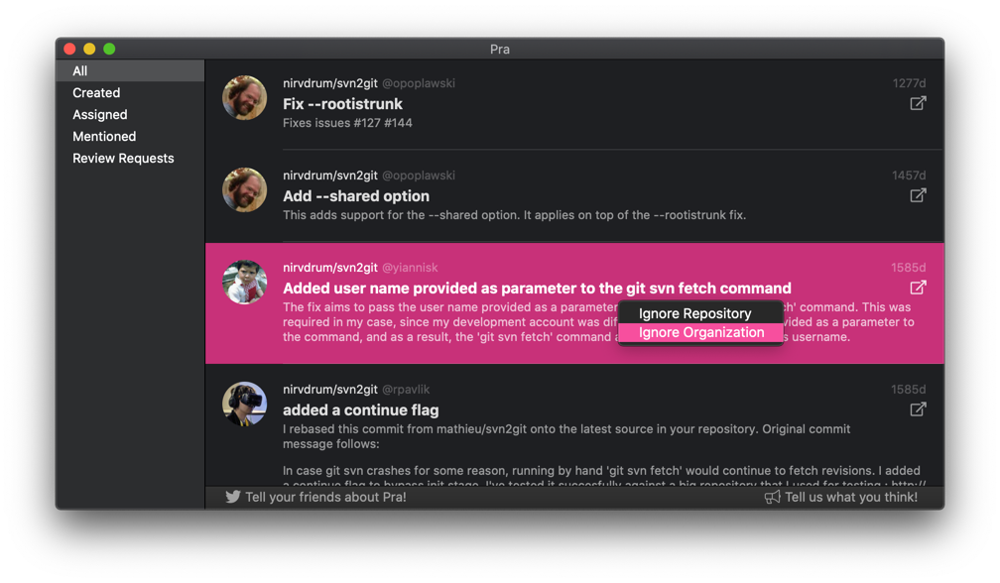
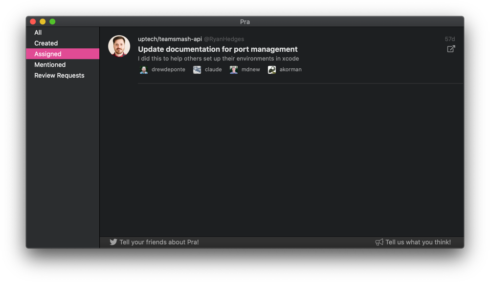

+++
title = "Pra v1.3.0"
date = 2019-07-18T09:32:01-08:00
updated = 2019-07-18T09:32:01-08:00
draft = false
template = "blog/page.html"

[extra]
authors = ["drewdeponte"]
thumbnail = "/img/posts/thumbnails/logo-pra.png"
+++

This release includes a mix of foundational features, small improvement features, as well as some bug fixes, performance improvements, etc.

## Ignore Organizations

We added the ability to **Ignore Organizations** in addition to already being able to ignore a repository. This is an extemely useful feature that can help you gain focus by ignoring pull requests that belong to organizations you are a member of but aren't interested in reviewing.

## Quick Filters

We also added a foundational feature, Quick Filters, in this release. It includes the *Created*, *Assigned*, *Mentioned*, and *Review Requests* quick filters while also laying the foundation for the future. Quick Filters enable quickly filtering the set of pull requests down based on a particular mindset. Below are a few mindsets and their associated quick filters.

- Trying to catch up on what last happened on one of your pull requests? Use the **Created** quick filter.
- Trying to remember what pull requests you are responsible for? Use the **Assigned** quick filter.
- Want to know who is talking about you? Use the **Mentioned** quick filter and see the pull requests that mention you.
- Can't keep track of all the requests for reviews? No, problem see them with the **Review Requests** quick filter.

## Bug Fixes, Performance Improvements, etc.

In addition to the above changes we also did the following.

- fixed a small layout issue in Preferences
- switched from GitHub v3 REST API to GitHub v4 GraphQL API
- made some performance improvements

The most significant of these changes was switch to GitHub v4 GraphQL API as it facilitates getting the right data out of GitHub in a more efficient fashion. It also puts us on their latest API so that we don't have to be worried about the API being deprecated out from under us.

Overall we think this release was an excellent step in the right direction and hope you enjoy the new features. As always we love hearing from you. So, don't hesitate ping us on [Twitter](https://twitter.com/uptechstudio) or [email](mailto:pra@uptechstudio.com).

