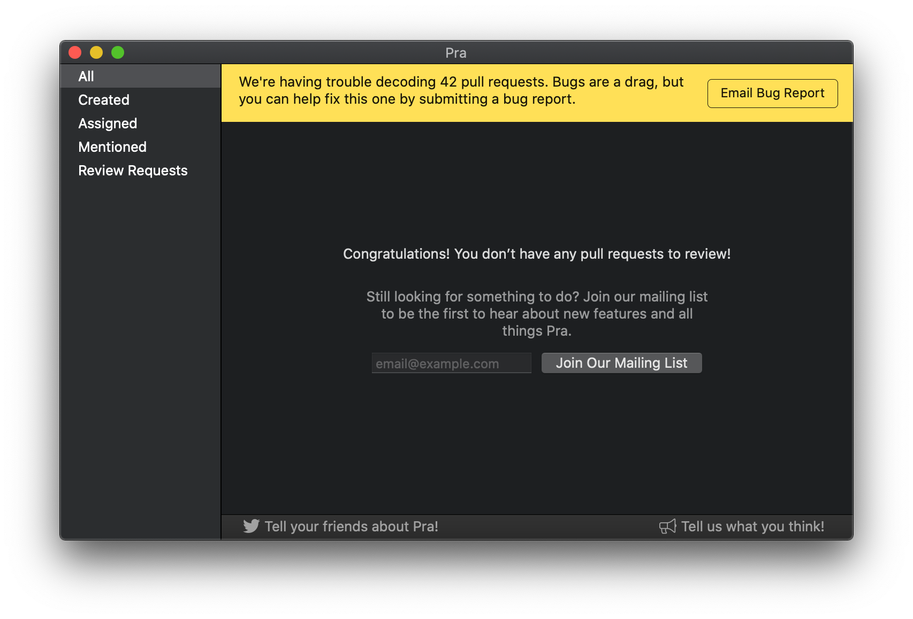
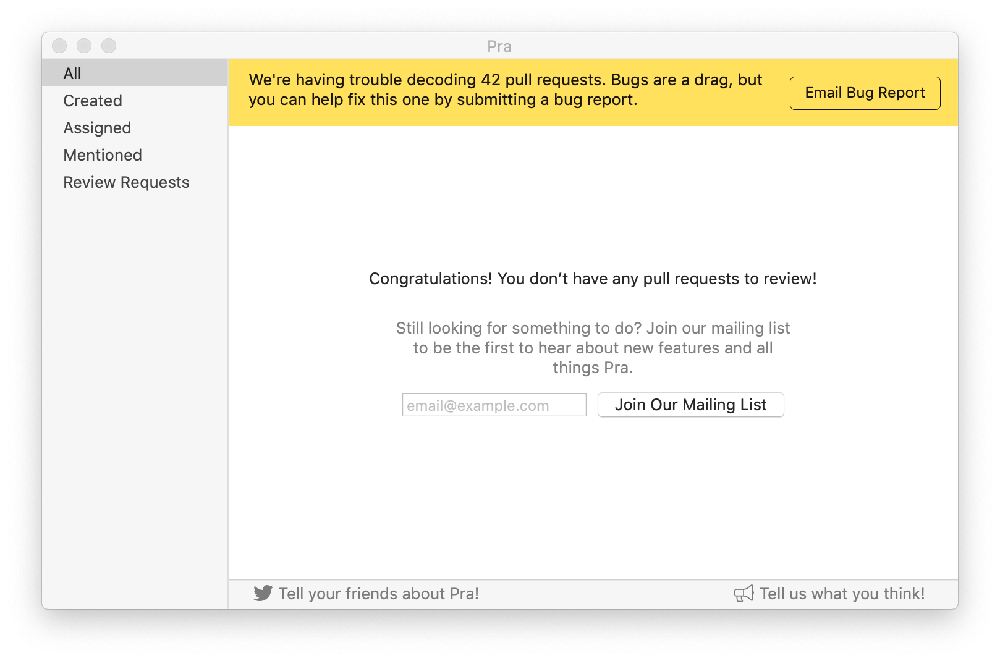

+++
title = "Pra v1.4.0"
date = 2019-08-21T09:32:01-08:00
updated = 2019-08-21T09:32:01-08:00
draft = false
template = "blog/page.html"

[extra]
authors = ["drewdeponte"]
+++

Version v1.4.0 of Pra just made it to the App Store. 

This release was focused on reliability and robustness. The last release was focused more heavily on new features. If you missed that checkout the [Pra v1.3.0](/blog/pra-v1-3-0-released) post.

### Reliability

After the [v1.3.0 release](/blog/pra-v1-3-0-released) I quickly got feedback that there were some reliability issues. First there were reports of an infinite loading spinner. After some investigation we discovered it was a side effect of JSON decoding failing in the scenario where a pull request has a requested reviewer that is a GitHub team. So, we resolved both of these bugs in this release.

### Robustness

We also realized while digging into the above mentioned reliability issues that we had the following robustness issues.

- The existing logging wasn’t generally valuable
- The decoding of the fetched pull requests would fail if any of the decoding failed. So, if it couldn’t decode 1 out of 20 pull requests the user would still get 0 pull requests back.
- When JSON decoding failures happened we had no way of easily finding out or getting useful information that would help us resolve them in the future.

To address these robustness issues I made tho following changes:

- Migrated logging from mix of `NSLog` and `print` calls over to the newer standard `OSLog` interface.
- Eliminated useless logging, cleaned up and categorized the logging I kept so that users would have a much easier time finding valuable logs.
- Added more detailed error logging when JSON decoding fails happen in the hopes that it is more helpful in identifying & fixing issues.
- Added fail-able Pull Request decoding so that successfully decoded pull requests are presented to the user and unsuccessful pull request decodings are logged.
- Added a flash notice system to be able to inform the user in-app about things. Specifically, I used this to inform the user of pull request decode failures and provide a call to action enabling them to send a debug report so that we might address the issue.

