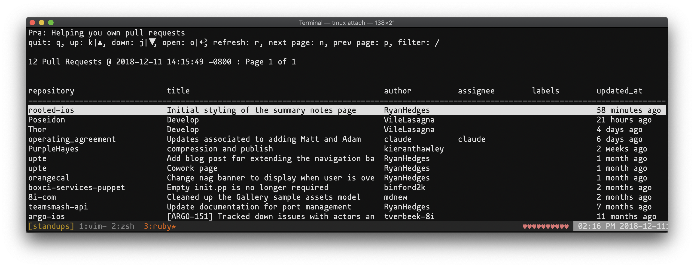
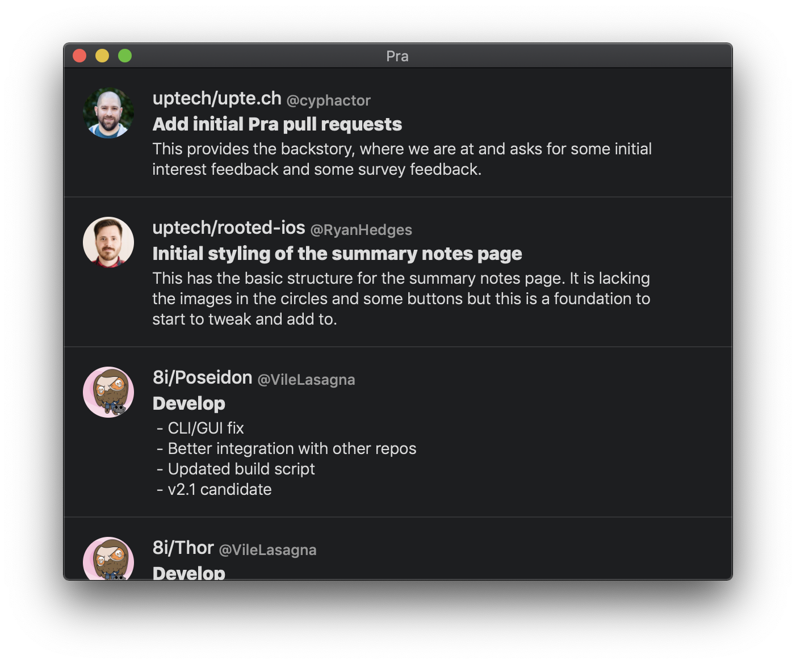

+++
title = "Pull Request Notifications: an Anti-Pattern"
date = 2018-12-11T09:32:01-08:00
updated = 2018-12-11T09:32:01-08:00
draft = false
template = "blog/page.html"
author = "Drew De Ponte"
+++

Back in 2013, I was lead of a software development team at ReachLocal, Inc. At the time we were using GitHub for open source projects and Atlassian Stash for our private Git repositories.

We required at least one reviewer to review each pull request before it could be merged into the mainline. We also generally didn’t assign specific people to pull requests as reviewers because we wanted to promote knowledge sharing throughout the company. So, people had to go grab a pull request or two every once in a while and review them.

## Problems
Email notifications didn't really work well in this scenario and they have a tendency to get lost in peoples’ inboxes. So naturally we progressed to annoying our teammates via our company chat system (Slack, now) until someone eventually reviewed the pull requests.

It didn’t take me long to realize that we had fallen into a communication anti-pattern — people didn’t need instant feedback on their pull requests. Also, the chat messages announcing pull requests ready for review generally got lost in the mix of the other chat messages, and the author would end up posting a message again and again to get peoples’ attention and hopefully get a review. This was also having the negative impact of breaking the developers on the team out of “deep work” and costing a huge amount in terms of context switching.

At the same time, we were having problems losing track of pull requests across a number of repositories (and across different Git repository management systems). This would happen all the time, as we had different repositories for various libraries, services, and micro-services we had built out for the systems my team was responsible for. Since the only way to proactively check for pull requests to review was to go to each individual repository and check the pull request tab, it's not surprising that they would fall through the cracks.

## Baby Step
The culmination of these problems drove me to try and come up with a solution. Something that would ideally **show me all of the pull requests that I cared about seeing, none of the ones I didn’t, and exactly when I wanted to see them**.

As a developer, my natural tendency is to build a software application to solve my problems. So that is exactly what I did. I created an open source terminal based curses application in Ruby called [uptech/pra](https://github.com/uptech/pra) (Pull Request Aggregator). 

This app was a great step in the right direction and many people continued to use it as we went on to work at other companies. But, it was definitely lacking in certain areas largely due to the limitations of curses. For instance, if it had GUI then it could provide more information in a more concise view as well as provide other functionality around viewing specific types of pull requests, etc.

## State of the World
Jump forward about 5 years to December 2018 and sadly not much has changed in the pull request world. On my front, I am the co-founder & co-owner of a very small ([5 of us in total](/about)) boutique Software Product, Design, and Development Consultancy, [UpTech](https://upte.ch) where our mission is to provide services and tools to Makers that help them bring their dreams to life.

The team here at [UpTech](https://upte.ch) was going through a list of potential products we could build. Looking at pull requests and the space around them, we still believe there is a gap in the workflows and the lack of tooling around them. Therefore we have decided to tackle this problem space. We believe building a GUI version of [uptech/pra](https://github.com/uptech/pra) is a great place to start and iterate from. Although we have envisioned a much more feature rich application that we think will solve other problems, we are approaching a point where we plan to release a free version that even in an early form would be useful and valuable. To get a taste, below is a snapshot of a very early, very rough internal build.

## The Future
Being a very small boutique (yet experienced) product, design, and development team, we know better than to just build something and hope that our vision is right. We need to vet our theories before we invest lots of time and money into making them a reality.

This is where you come in. I know it is a lot to ask, but we need help vetting some directions we are thinking about taking the product. So, we have put together a [small single page survey](https://goo.gl/forms/otHy58AVGkRvbZMm1) to help guide us on some of these decisions.

<a class="btn btn-lg btn-outline-dark text-center" href="https://goo.gl/forms/otHy58AVGkRvbZMm1">Fill Out the Survey</a>

If you have read this and have experienced some of these issues and would value a product focused on solving problems in this space please provide your email below showing your support for this product. We promise we won’t spam you. We will provide you with details about launches, ask for feedback about certain features, and invite some of you to alpha or beta releases.

