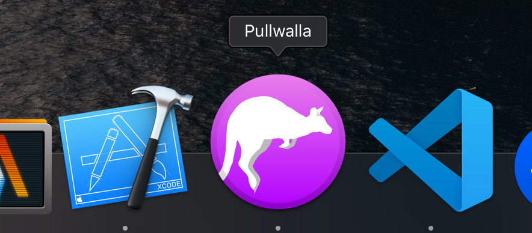
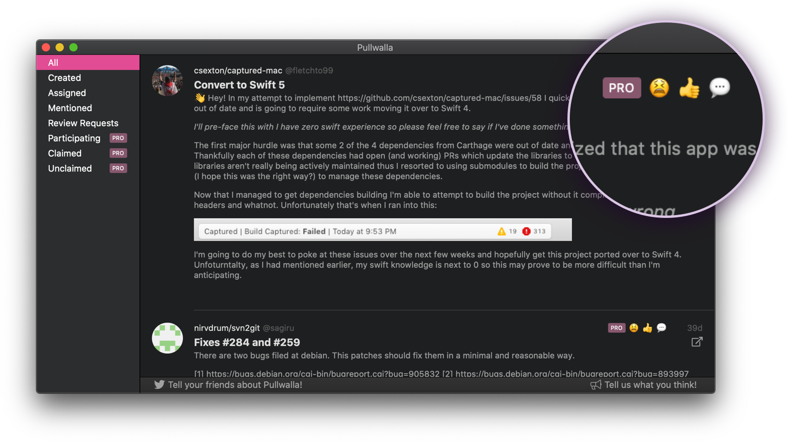
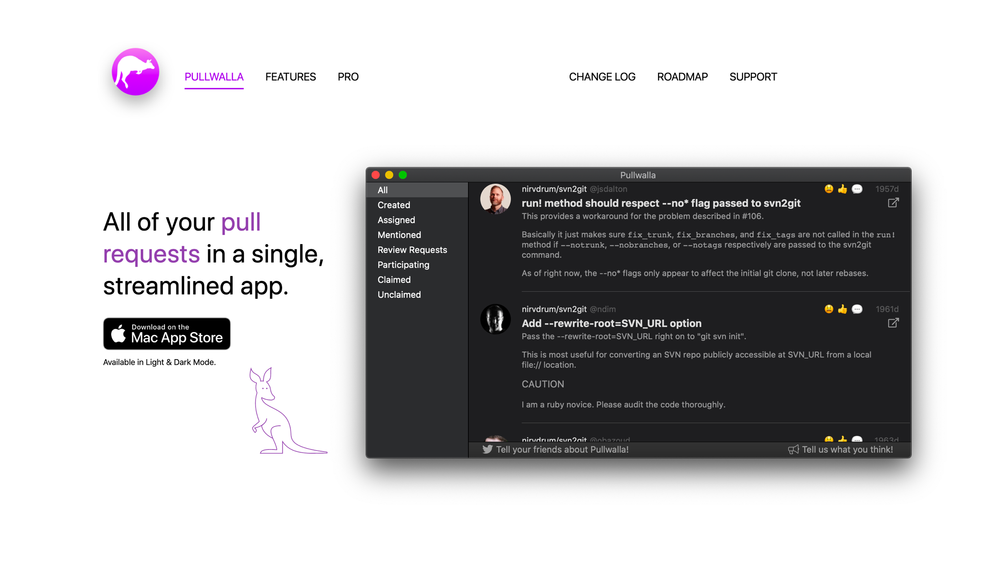

+++
title = "Pullwalla is now in the App Store"
date = 2019-11-18T01:32:01-08:00
updated = 2019-11-18T01:32:01-08:00
draft = false
template = "blog/page.html"

[extra]
authors = ["philipjohnson"]
thumbnail = "/img/posts/thumbnails/logo-pullwalla-macos-big-sur.png"
+++

## Pra is now Pullwalla!

The app that began as a command line tool named Pra has made the next step in its journey with a new name and new features.

The goal remains the same: Pullwalla is designed to be a single, unified interface that allows you to easily manage all the pull requests you care about.

## New Name and Logo

The new name reflects a change in focus from a minimal, text-based list of pull requests to a full-featured, modern client that is both informative and a pleasure to use.

The roots of the app haven’t changed—it aims to be simple, helpful, and unobtrusive. Pullwalla, just like its namesake wallaby, takes advantage of its diminutive size to remain fast, nimble, and quiet.

## New Features

This release features more than just a makeover. We have added characteristics to help you quickly identify the state of your pull requests. New quick filters help you quickly drill down to exactly what you need. Bugs have been squashed.

And that’s not all—plenty more features are in the works.

## New Website

A new name deserves a fresh [website](https://pullwalla.com/?utm_source=uptech&utm_medium=blog-post&utm_campaign=uptech-blog-pullwalla-launch). We have created a landing page to highlight features.

 A [support page](https://pullwalla.com/support/?utm_source=uptech&utm_medium=blog-post&utm_campaign=uptech-blog-pullwalla-launch) with frequently asked questions will help you get started quickly. A [change log](https://pullwalla.com/changelog/?utm_source=uptech&utm_medium=blog-post&utm_campaign=uptech-blog-pullwalla-launch) lets you know what we’ve been working on in the past, while the new [roadmap](https://pullwalla.com/roadmap/?utm_source=uptech&utm_medium=blog-post&utm_campaign=uptech-blog-pullwalla-launch) allows us to highlight what we’re working on now and what we have planned for the future.

## More to come...

We’re excited about all the changes we have in store! We hope you find Pullwalla as useful and pleasurable as we do.

Please [drop us a line](mailto: pullwalla@uptechstudio.com) if you have any questions, comments, or suggestions.

