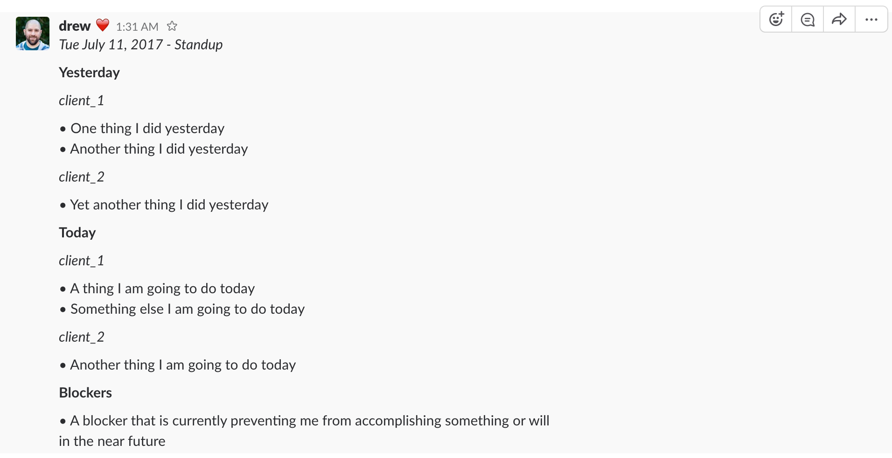
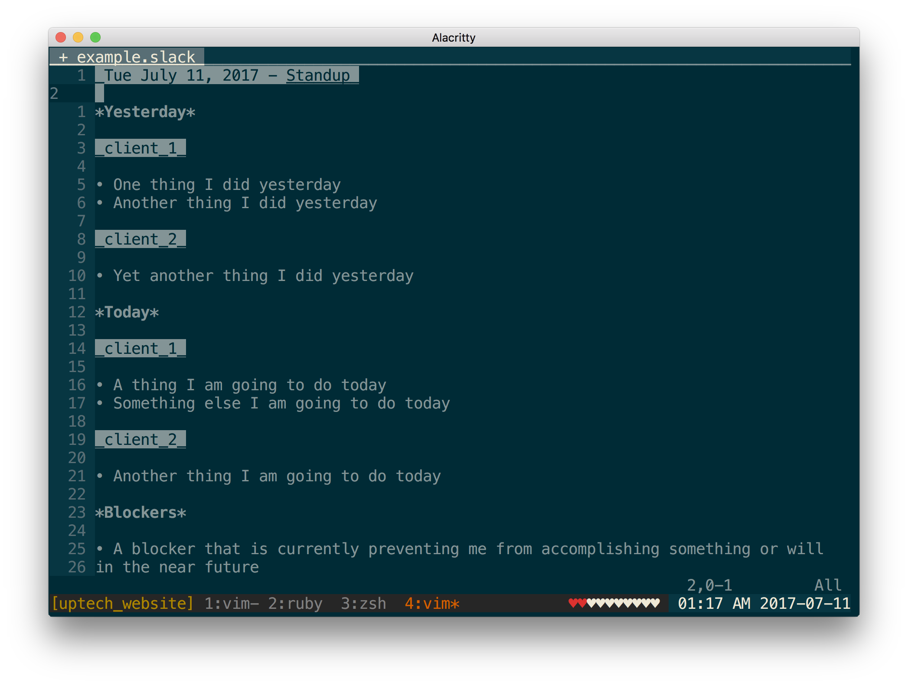

+++
title = "Remote Stand-ups at UpTech"
description = "Daily stand-up meetings are great, but hard when some (or all) of your team works remotely. At UpTech we rely on Slack to hold virtual standups."
date = 2017-07-10T11:53:01-08:00
updated = 2017-07-10T11:53:01-08:00
draft = false
template = "blog/page.html"
author = "Drew De Ponte"
+++

### The Problem

Given that UpTech is a consultancy, our team is often pretty fragmented in terms of physical location. For example, I might be on-site at a client's office while another member is at a different client's office, and yet other members are at our office. This physical fragmentation makes it difficult to stay on top of what is going on across the organization on a day-to-day basis.

### Normal Solution

Normally, in a startup we would have a stand-up every morning to kick-off the day. If you aren't familiar, a stand-up is a time-boxed meeting that is used in many agile methodologies to facilitate communication around individuals' daily commitments, as well as raise awareness of any challenges (a.k.a.  blockers). The reason it is called a stand-up is because the thinking is that if everyone has to stand during the meeting it would help keep the meeting short. For further details on stand-ups and their intent check out the [Wikipedia page][stand-ups].

### Our Solution

Given that our team is rarely in the same physical location at the same time, we have taken the principles and intent from the stand-up and adapted it to our situation by using a [Slack][] `#standups` channel to share our commitments and blockers every morning at 10 am. To aid with making sure we have the stand-up right at 10am everyday, we set up a [Slack reminder][] in the `#standups` channel. 

Then in the `#standups` channel we communicate the classic stand-up information: What did I do yesterday?, What am I doing today?, Do I have any blockers? Specifically, we use the following template and generally prepare the mornings stand-up in a text buffer before pasting it into the `#standups` channel. The template/example below is based on the [Slack message format][].

```
_Tue July 11, 2017 - Standup_

*Yesterday*

_client_1_

• One thing I did yesterday
• Another thing I did yesterday

_client_2_

• Yet another thing I did yesterday

*Today*

_client_1_

• A thing I am going to do today
• Something else I am going to do today

_client_2_

• Another thing I am going to do today

*Blockers*

• A blocker that is currently preventing me from accomplishing something or will in the near future
```

When the above is pasted into [Slack][] it looks as follows:



Given that this is such a core part of our process and that I am a heavy [Vim][] user, I created the [Vim Slack Format][] plugin to provide syntax highlighting in [Vim][] for the [Slack message format][]. When using this plugin it looks as follows:



Without this virtual stand-up every morning we wouldn't be able to successfully run our business. It constantly triggers discussions, questions, suggestions, etc. following the stand-ups.

### How you can use this?

If you work for a consultancy yourself, you might find this solution and template above valuable for the same reasons we do. However, if instead you are simply on a remote team, where there aren't multiple clients you could easily modify the format to the following simpler version and get the same value out of it.

```
_Tue July 11, 2017 - Standup_

*Yesterday*

• One thing I did yesterday
• Another thing I did yesterday
• Yet another thing I did yesterday

*Today*

• A thing I am going to do today
• Something else I am going to do today
• Another thing I am going to do today

*Blockers*

• A blocker that is currently preventing me from accomplishing something or will in the near future
```

At the end of the day, like any tool/process. It comes down to having an open minded collaborative team that understands the value of process and communication to really get the value out of a practice like this. Tools are never a solution for culture.

[stand-ups]: https://en.m.wikipedia.org/wiki/Stand-up_meeting
[Slack reminder]: https://get.slack.help/hc/en-us/articles/208423427-Set-a-reminder
[Slack]: https://slack.com
[Slack message format]: https://get.slack.help/hc/en-us/articles/202288908-Format-your-messages
[Vim]: http://www.vim.org
[Vim Slack Format]: http://github.com/uptech/vim-slack-format
