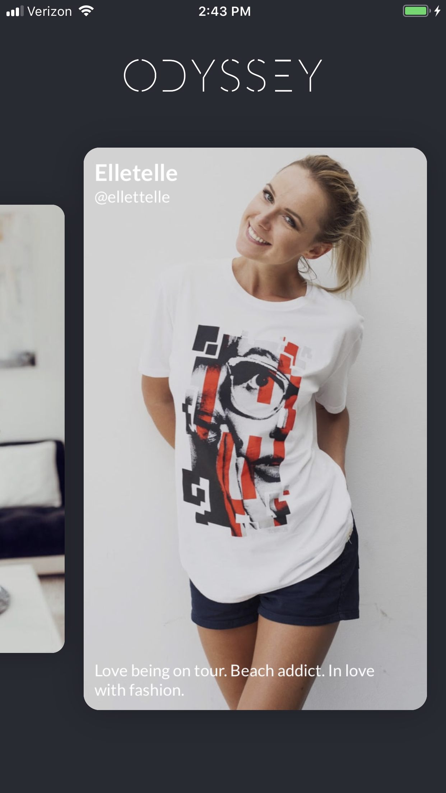
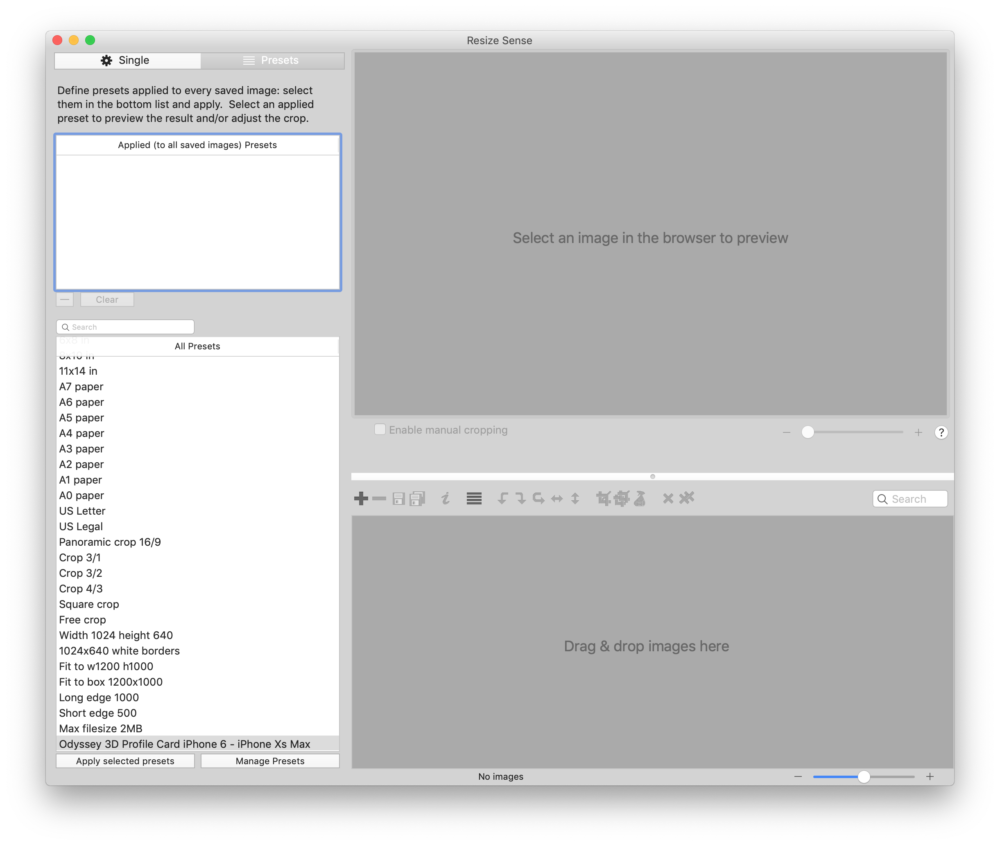
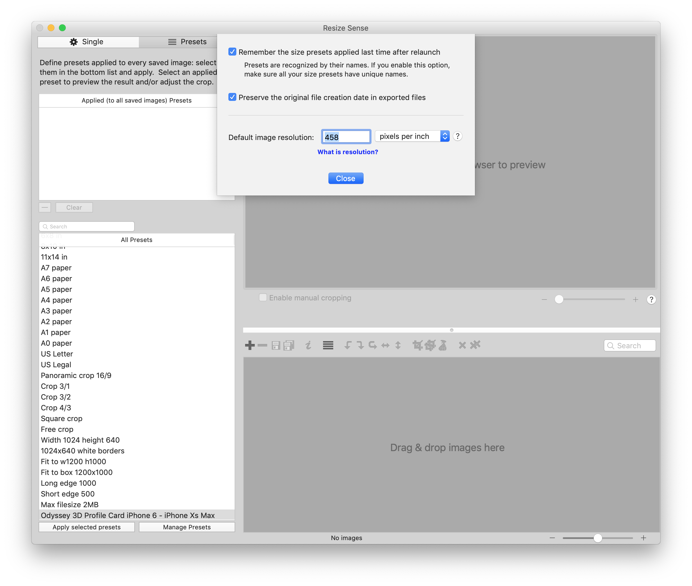
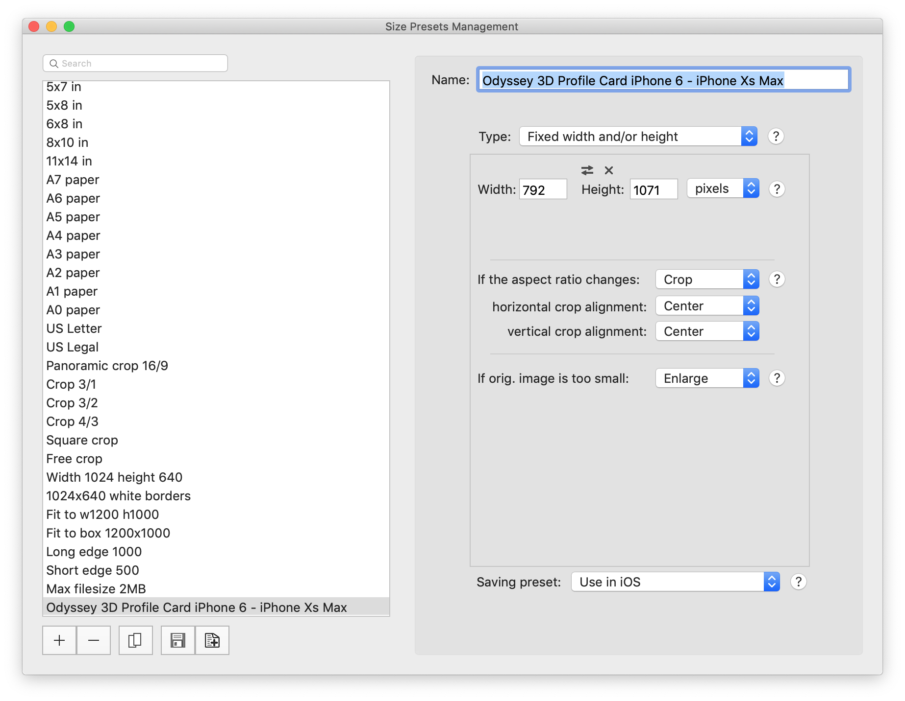
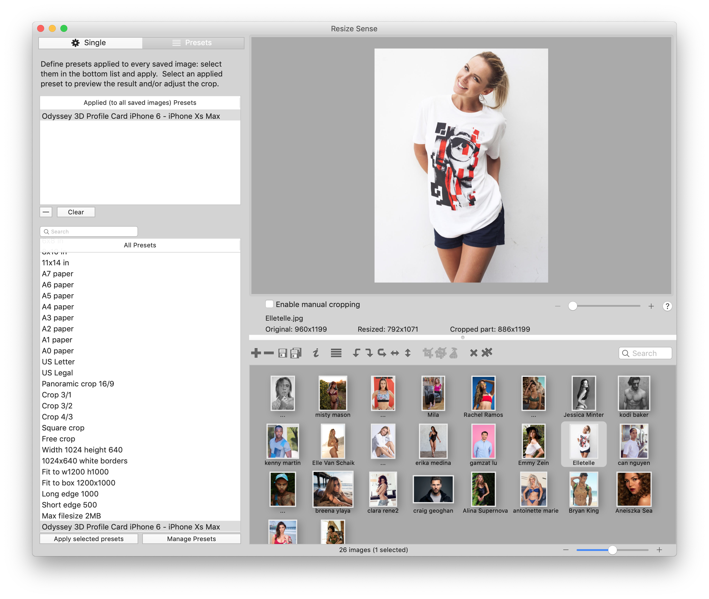
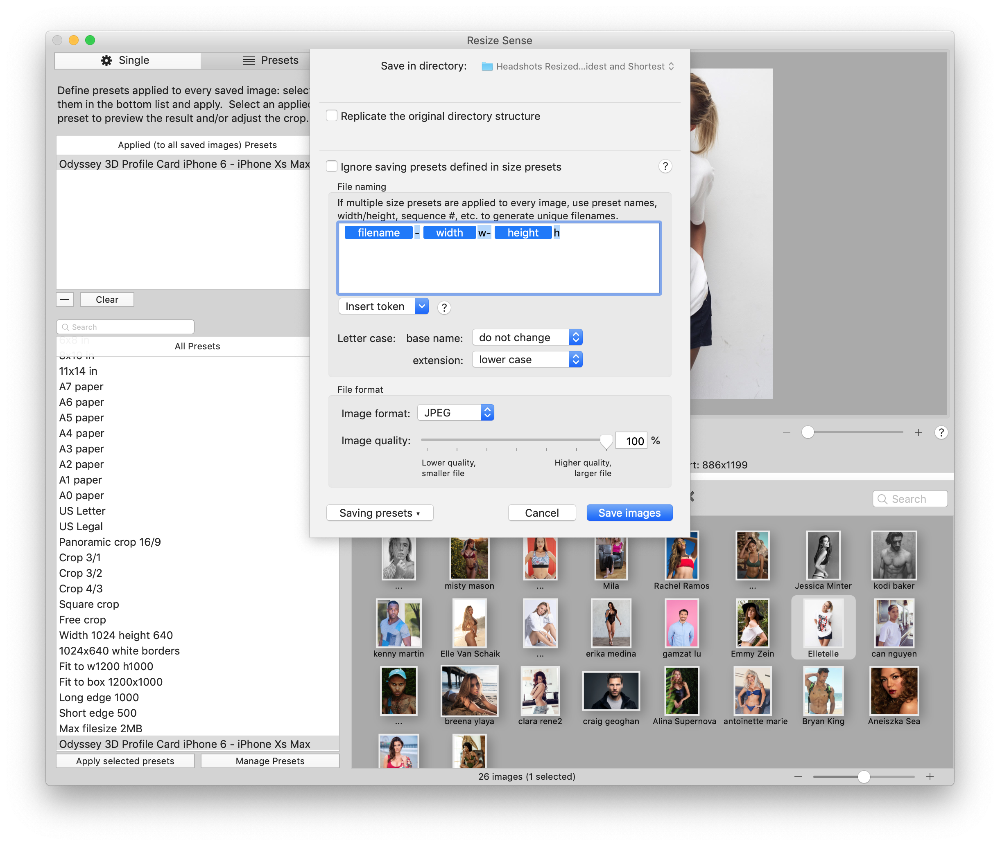
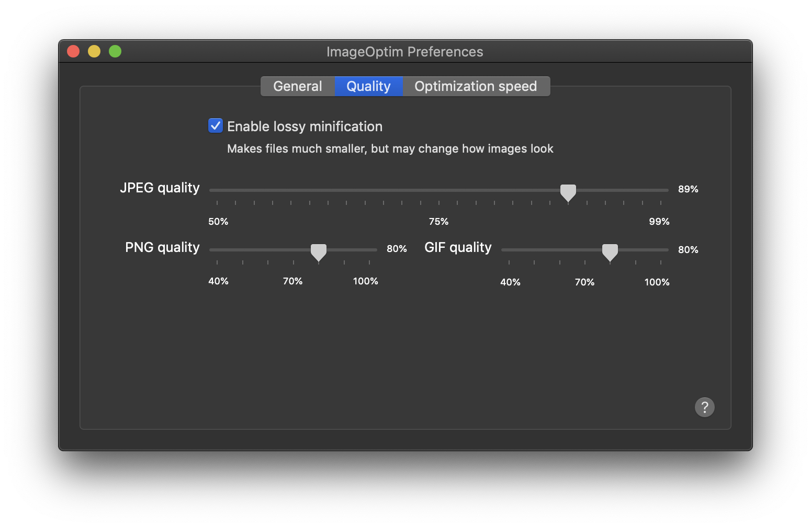

+++
title = "Sizing and Optimizing Images for iOS"
date = 2018-11-09T09:32:01-08:00
updated = 2018-11-09T09:32:01-08:00
draft = false
template = "blog/page.html"

[extra]
authors = ["drewdeponte"]
thumbnail = "/img/posts/thumbnails/logo-resize.png"
+++

## Why?

Sizing and Optimizing images for iOS can have a huge impact on performance of your app and the overall user experience. Therefore, it is important to take the time to figure out the proper sizing for your images and to make sure that they get appropriately resized and optimized for your needs.

## Understanding your constraints

I like to start by figuring out the devices that I am interested in supporting. I was recently working on an app where we wanted to support the iPhone 6 all the way up to the latest iPhone Xs Max. So to figure out the sizes of the images I needed some context as to what size in points the screens on those devices are and at what resolution they get rendered. I use [The Ultimate Guide To iPhone Resolutions][] all the time for this type of reference.

In this case since I am supporting iPhone 6 as the lowest size which is **375 x 667** points and the iPhone Xs Max as the largest size, **414 x 896** points. If you look at all the point sizes between that range of phones. There are really two different aspect ratios I need to support **0.46** for the iPhone Xs Max, iPhone Xr, iPhone X, iPhone Xs, and **0.56** for the iPhone 6+, 6s+, 7+, 8+, 6, 6s, 7, and 8.

This means that I am most likely going to have to do some cropping depending on which device the images are loaded on.

### Image space in points

Now that I have some context in terms of max size and min size. I need to figure out what the point size of the actual image space is going to be.
I approached this in this scenario by adding a log line to the app that logged point size of the frame of the image area.

For [this particular app](https://itunes.apple.com/us/app/odyssey-3d/id1435538334?&mt=8) I am implementing a carousel of profile pics of people participating in the application. At the moment I had an iPhone X and a iPhone 7+ with me. So, I built the app and ran it on both the iPhone 7+ and the iPhone X to get the point size of the profile cards on those devices from the logs.

 
<table style="width: 300px;">
  <tr>
    <th>
      Device
    </th>
    <th>
      Size in Points
    </th>
    <th>
      Aspect Ratio
    </th>
  </tr>
  <tr>
    <td>
      iPhone 7+
    </td>
    <td>
      254 x 416
    </td>
    <td>
      0.61
    </td>
  </tr>
  <tr>
    <td>
      iPhone X
    </td>
    <td>
      215 x 434
    </td>
    <td>
      0.49
    </td>
  </tr>
</table>
 

From there I could deduce what the point size of the Profile Card would be on the iPhone 6 and the iPhone Xs Max by looking at the difference in points between the screen sizes. For example the iPhone 6 screen size is **375 x 667** and the test device I had was an iPhone 7+ at **414 x 736** which is **39** points wider and **69** points taller. Knowing that, I can apply those difference to the iPhone 7+'s Profile card point size of **254 x 416** resulting in the Profile Card being **215 x 347** points on iPhone 6.

The same concept can be applied going from The iPhone X Profile Card point size to the iPhone Xs Max Profile Card point size. In this case the iPhone X Profile Card point size is **215 x 434** and the there is a difference of **39 x 84** between iPhone X and iPhone Xs Max point sizes. When applied this results in the Profile Card being **254 x 518** points on iPhone Xs Max.

 
<table style="width: 300px;">
  <tr>
    <th>
      Device
    </th>
    <th>
      Size in Points
    </th>
    <th>
      Aspect Ratio
    </th>
  </tr>
  <tr>
    <td>
      iPhone 6
    </td>
    <td>
      215 x 347
    </td>
    <td>
      0.619
    </td>
  </tr>
  <tr>
    <td>
      iPhone Xs Max
    </td>
    <td>
      254 x 518
    </td>
    <td>
      0.490
    </td>
  </tr>
</table>
 

All of that was to understand the point size dimensions of the smallest image and largest image spaces that I want to support and make sure they look beautiful. From this data I see one very important thing. The aspect ratios are not the same. This means that there is going to be some cropping happening.

### Where to crop

In this case I was prepping these images for profile pictures of people and they were sending their headshots to us. Most of these headshots had one thing in common, the persons face was toward the top of the image and relatively centered horizontally. For this particular type of content it is safer to crop off the sides of the images generally, rather than cropping off the top as I don't want an image to crop someones face.

If I were for example to make the size of the images match the largest devices height, on the smaller devices with the different aspect ratios peoples heads would get chopped off like you see in the example.

Because I don't want to lose any of the tops of the images. I needed to use the smallest height and the widest width from our device extremes for the image. This covers me in all the sizes between and will make it so only the sides get cropped. Yes, it does mean that I have some upscaling happening on the larger devices. But, in this case we did this optimization and tested it and found the upscaling looks fine as it is relatively minimal.

In my case that meant that the image size in terms of points that I wanted to produce for these profile cards was:

 
<table style="width: 300px;">
  <tr>
    <th>
      Universal Image Size (points)
    </th>
  </tr>
  <tr>
    <td>
      (Longest Width) x (Shortest Height)
    </td>
  </tr>
  <tr>
    <td>
      (iPhone Xs Max Width) x (iPhone 6 Height)
    </td>
  </tr>
  <tr>
    <td>
      254 x 347
    </td>
  </tr>
</table>
 

### Getting the Resolution Right

Now that I have an understanding of the image space I need to worry about in points for the image. I need to figure out what size the actual image should be in pixels. Given that points are the representation in iOS land when you are developing and pixels are what points get translated into and rendered out to on the screen. We need to have an understanding of how these devices render pixels out. Luckily [The Ultimate Guide To iPhone Resolutions][] provides this information for us as well.

If we look at the iPhone Xs Max we can see that it renders to the screen at **3x**. This means at a value of it's screen's point size multiplied by 3. The iPhone 6 on the other hand looks to only render at 2x. Meaning 2 times it's point size. So, I am now presented with a choice. Option one, pick the 2x rendering of the iPhone 6. This would result in a pixel size of **508 x 694**. This size would leave a pretty big gap for the larger devices to fill with upscaling. The other option is to use 3x rendering of the iPhone Xs Max which would result in a pixel size of **762 x 1041**. This seems like a much more reasonable size for the larger devices and it will just be scaled down to fit on the smaller screen devices like the iPhone 6.

Therefore, I opted for the later option of a pixel size of **762 x 1041**. I took this size and added an extra 30 pixels to both the width and the height as I am planning on using some image techniques later on in the app that would require having that overage. So I really resulted in wanting images at **792 x 1071**.

### Batch Scaling Images

Now, that the hard part of figuring out what the best size for the image is. The easy part can begin. I found this wonderful little app named [Resize Sense][]. It provides the ability to batch apply various transformations to images. In this particular case it will help me fit, scale, and crop the images that people sent me to the appropriate size. It is worth noting that it isn't the most intuitive app but it does work well. So, experiment with it a bit and it will be well worth it.

The first thing I did after launching the [Resize Sense][] was to check out the **Preferences**. I quickly noticed that it has a **Default image resolution:** option which is defaulted to 300 pixels per inch. This got me wondering what the pixels per inch on the iPhones where. A little googling lead me to **458** pixels per inch so I updated that preference. I am not sure why this is a global setting. It seems like it should be a setting in the presets but I haven't seen it in there so I just went with it as a global setting.

After that I discovered that I need to build what they call a Custom Preset. I did this by clicking the **Manage Presets** button and defining a preset as follows. *Note*: According to their documentation it is important that presets have unique names. You will notice that the pixel dimensions of the image preset are the same ones we determined above.

After creating the preset I needed to select it and click the **Apply selected preset** button which then moved it to the applied presents list. And then I went and selected the first batch of headshot images people sent me and dragged them into the lower right pane of the app and selected one of the images. This applied the transformations and showed me a preview of the resulting image in the upper right pane.

From there I simply selected **Save All images** from the **File** menu and selected a destination for the files, loaded the saving preset from the custom preset I made earlier and clicked **Save images**. This batch processes all the images I gave it and produced a resulting set of images that had been sized appropriately, cropped, etc.

The only issue was that the JPEG image optimization in [Resize Sense][] isn't very good. This isn't actually a huge problem as there is a community defacto standard that is used which is easy and we know is good. Therefore, I ran the batch scaling, etc. to output at 100% JPG quality as I knew that it would be optimized later.

### Optimization

Now, that I had a batch of appropriately sized images for the App's Profile Pictures I wanted to compress and optimize them to try and reduce their file size even further. It is worth noting that when I started this process I was dealing with multi-megabyte file sizes for these images.  So, next I opened [ImageOptim][], a wonderful little macOS application that is as simple as they come, and I configured the preferences to be as follows by clicking the little gear icon.

Then, I dragged all the image files that were output by [Resize Sense][] and [ImageOptim][] did it's thing and I ended up with great looking images that were now sub 100kb.

This is a huge game changer for the performance of the application as these images are downloaded over often slow cellular networks.

So, please make sure you take the time to properly figure out the right image sizes for your app and please optimize them.

[The Ultimate Guide To iPhone Resolutions]: https://www.paintcodeapp.com/news/ultimate-guide-to-iphone-resolutions
[ImageOptim]: https://imageoptim.com/mac
[Resize Sense]: https://veprit.com/resizesense
