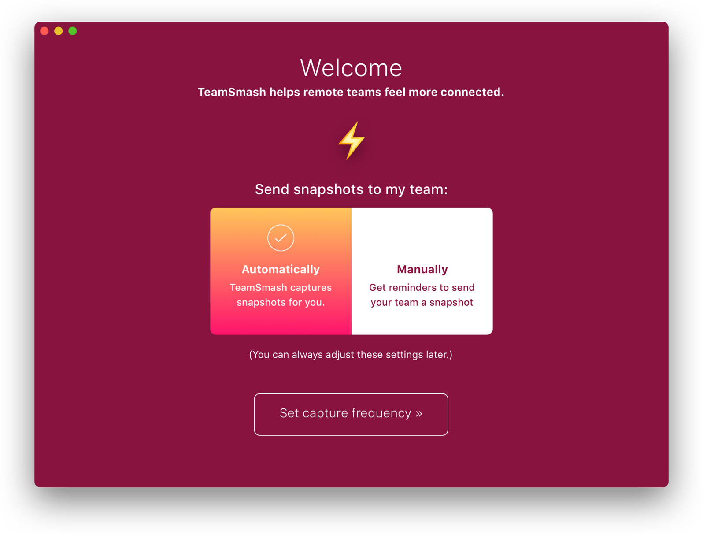
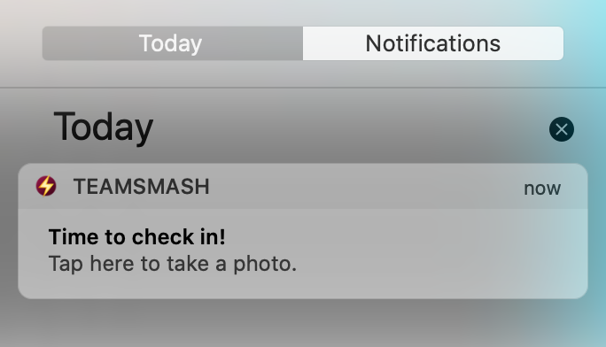
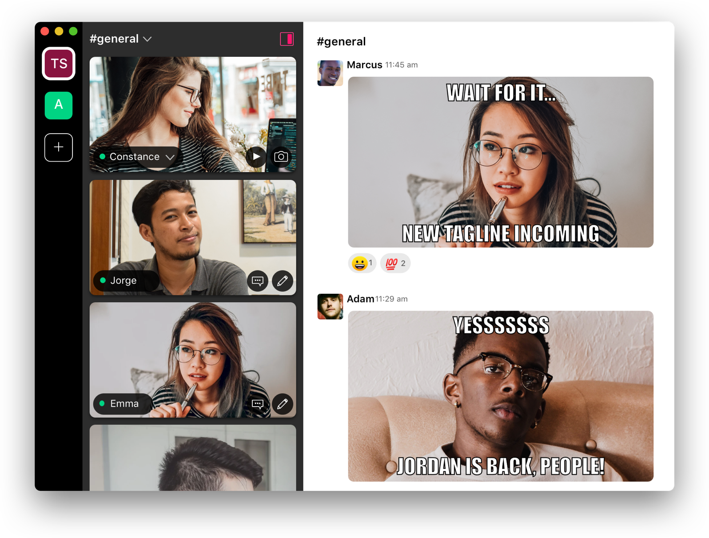

+++
title = "TeamSmash - Manual Capture mode in latest update"
date = 2020-04-20T08:30:01-08:00
updated = 2020-04-20T08:30:01-08:00
draft = false
template = "blog/page.html"

[extra]
authors = ["ryanhedges"]
+++

If you don't already know, UpTech has created a Mac App to help teams stay connected through photos. It's a very useful app and it has provided us a lot of fun and comradery as we use it every day.

As the application has gained adoption, we've received feedback from users that they'd would like more granular control over when a photo is captured. Currently, you can have a photo taken at various automatic intervals (e.g. 5 minutes, 10 minutes) or by clicking the manual photo button. We realized that if you opted out of automatic capture mode, you may find yourself forgetting to participate in all the fun. So today, we're excited to announce that we are adding a new manual capture mode in the latest release to help people stay connected!

### How manual mode works

Manual mode allows the app to send you push notifications at an interval of your choice to remind you to take a picture. Right from there you can take a picture or decide to ignore it. This allows you to have more control over when and how you present yourself to your team. It also opens up the chance for you to show off a nice smile or a funny face to brighten up your teams day!

### What else does TeamSmash do?

TeamSmash integrates with your Slack team, so you can see all the people you care about. Do you want to see who's available from marketing? Jump to the TeamSmash channel with the same Slack channel name and see who's around! By taking snapshots at regular intervals, your team stays connected with you, knowing when you're available through your status, and are able to quickly start up a conversation with you through slack. Without a video stream clogging up your internet and capturing every moment, you can now get work done while still being present with your team. And just to make things a little more interesting, you can create fun memes of your team to brighten everyone's day! TeamSmash can help your team connect and grow closer together whether they are in the same office or miles apart!

### How do I get TeamSmash

You can get TeamSmash today from the Mac App store!

