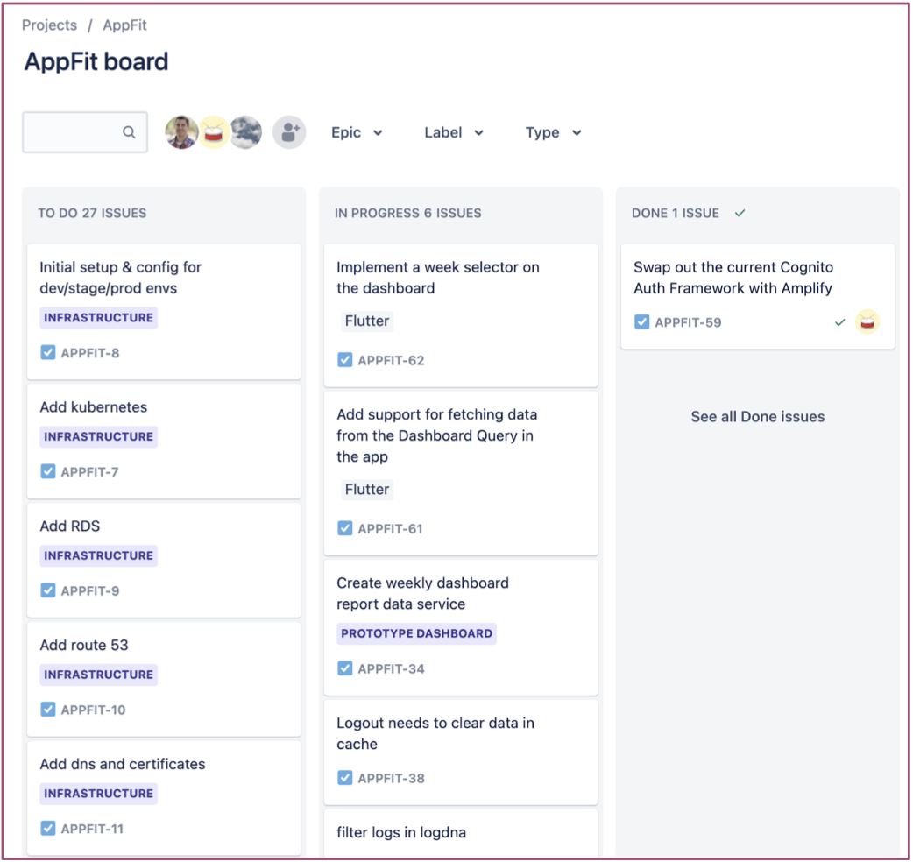

+++
title = "Kanban"
description = "How we do Kanban"
date = 2021-05-01T18:20:00+00:00
updated = 2021-05-01T18:20:00+00:00
draft = false
weight = 10
sort_by = "weight"
template = "docs/page.html"

[extra]
toc = true
top = false
+++

We are big believers in Agile methodologies. However we don't prescribe to strict Scrum. Instead we use Kanban as we feel it better aligns with the fluidity and agileness necessary with the earlier stage companies we work with.

In Kanban the columns on the board represent the prioritized queue of items that need to be done by each role in the software development process. Items move across the board until complete.

We often use work in progress limits for each column to guide us around capacity issues and enforce prioritization.

The Kanbana boards provide all stakeholders with a clear view into the development pipeline. Boards can be customized via grouping and filtering.

## Columns

Columns in Kanban are intended to be customized to the process at hand. By default most Kanban tools provide the following columns at a minimum.

* **TODO** - all things that the team can work on. By default, this list will continue to grow each week.
* **In Progress** - all the things the team is working on
* **Done** - the things the team has completed.

We generally evolve these on our projects to some combination of the following colmuns.

* **Selected for Dev** - Every new issue starts in Needs Review. Each week, we review this list and move issues to keep it empty.
* **Specs Needed** - Stories that need further specification, UX, and/or UI assets.
* **Ready for Dev** - Issues that are ready for the developers.
* **In Progress** - Issues being worked on by a developer.
* **QA/Acceptance** - Issues delivered by development and is now with QA and/or Product for testing.
* **Accepted** - Issues that are accepted and ready for release.
* **Released** - Issues that have been deployed to users.

*Note:* The above columns are guidelines we use to stay in alignment with eachother. But if we are on a project where we feel like a couple of these columns aren't need and are just ritual we will get rid of those columns.
