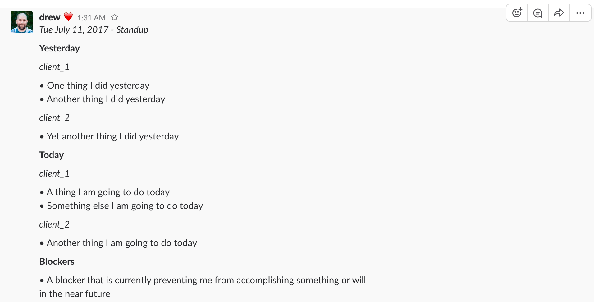
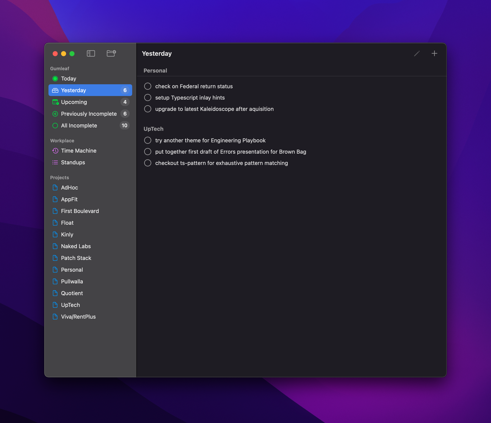
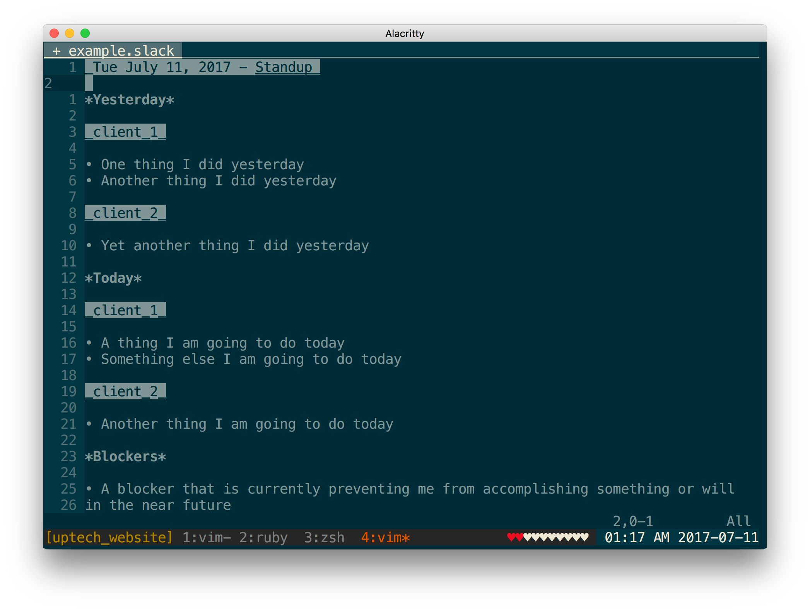

+++
title = "Standups"
description = "Overview of how we do standups"
date = 2021-05-01T18:20:00+00:00
updated = 2021-05-01T18:20:00+00:00
draft = false
weight = 20
sort_by = "weight"
template = "docs/page.html"

[extra]
toc = true
top = false
+++

### The Problem

UpTech Works, LLC has remote employees all over the US. Therefore our team is often pretty fragmented in terms of physical location. For example, I might be on-site at a client's office while another member is at a different client's office, and yet other members are at our office. This physical fragmentation makes it difficult to stay on top of what is going on across the organization on a day-to-day basis.

### Normal Solution

Normally, in a startup we would have a standup every morning to kick-off the day. If you aren't familiar, a standup is a time-boxed meeting that is used in many agile methodologies to facilitate communication around individuals' daily commitments, as well as raise awareness of any challenges (a.k.a.  blockers). The reason it is called a standup is because the thinking is that if everyone has to stand during the meeting it would help keep the meeting short. For further details on standups and their intent check out the [Wikipedia page][stand-ups].

### Our Solution

Given that our team is rarely in the same physical location at the same time, we have taken the principles and intent from the standup and adapted it to our situation by using a [Slack][] `#standups` channel to share our commitments and blockers every morning at 10 am. To aid with making sure we have the standup right at 10am everyday, we set up a [Slack reminder][] in the `#standups` channel. 

Then in the `#standups` channel we communicate the classic standup information: What did I do yesterday?, What am I doing today?, Do I have any blockers? Specifically, we use the following template and generally prepare the mornings standup in a text buffer before pasting it into the `#standups` channel. The template/example below is based on the [Slack message format][].

```
_Tue July 11, 2017 - Standup_

*Yesterday*

_client_1_

• One thing I did yesterday
• Another thing I did yesterday

_client_2_

• Yet another thing I did yesterday

*Today*

_client_1_

• A thing I am going to do today
• Something else I am going to do today

_client_2_

• Another thing I am going to do today

*Blockers*

• A blocker that is currently preventing me from accomplishing something or will in the near future
```

When the above is pasted into [Slack][] it looks as follows:



Without this virtual standup every morning we wouldn't be able to successfully run our business. It constantly triggers discussions, questions, suggestions, etc. that help keep the business on track and moving in the right directions.

## Client Standups

Not only do we post our complete standup in the `#standups` channel to share with UpTech Works, LLC. We also post client scoped versions of our standups in shared channels between UpTech Works and the respective client, .e.g. `#client1-uptech`. This helps in a number of ways.

* it helps keeps the client updated and clued into what things are progressing
* it gives an opportunity to highlight and remind the client about blockers that they might be able to facilitate
* it helps stay in alignment with client team and any coordination efforts between UpTech Works and them

The following is what the above UpTech Works, LLC standup would look like scoped down to `client1` and would be what we would shared in the `#client1-uptech`.

```
_Tue July 11, 2017 - Standup_

*Yesterday*

• One thing I did yesterday
• Another thing I did yesterday

*Today*

• A thing I am going to do today
• Something else I am going to do today

*Blockers*

• None
```

## Tools

The following are a few tools we have created/found that help with this process. Though at the end of the day, like any tool/process it comes down to having an open minded collaborative team that understands the importance of process and communication to really get the value out of a practice like this. Tools are never a solution for culture but they can reduce friction.

### Gumleaf

[Gumleaf][] is a side project of Drew De Ponte & Anthony Castelli where the beta release is being shared with UpTech Works, LLC to get feedback. It is a personal task management solution built around the concept of daily standups and also provides features to trivially scope standups down to specific clients as well as export standups in the Slack format.



This has become a daily driver for most of UpTech Works. For further details checkout [3rd Party Tools - Gumleaf][Gumleaf].

### Vim/Neovim

Given that this is such a core part of our process we created the [Vim Slack Format][] plugin to provide syntax highlighting in [Vim][] or [Neovim][] for the [Slack message format][]. When using this plugin it looks as follows:



This allows you to have a `standups.slack` file to facilitate keeping historical track of your standups in an easily searchable format where you keep the most recent standup at the top of the file. Some people even like to keep this in a [Git][] repository so that their history is pushed up to a remote on a regular basis.

[stand-ups]: https://en.m.wikipedia.org/wiki/Stand-up_meeting
[Slack reminder]: https://get.slack.help/hc/en-us/articles/208423427-Set-a-reminder
[Slack]: https://slack.com
[Slack message format]: https://get.slack.help/hc/en-us/articles/202288908-Format-your-messages
[Vim]: http://www.vim.org
[Vim Slack Format]: http://github.com/uptech/vim-slack-format
[Gumleaf]: /docs/3rd-party-tools/#gumleaf
[Neovim]: https://neovim.io
