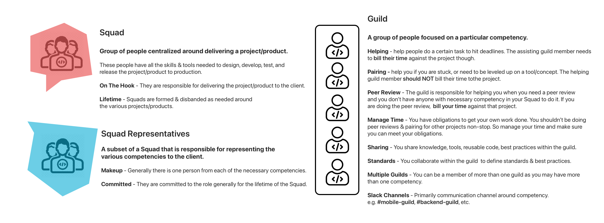

+++
title = "Squads & Guilds"
description = "Visual explainers of how we organize using Squads & Guilds here at UpTech Works, LLC"
date = 2021-05-01T18:20:00+00:00
updated = 2021-05-01T18:20:00+00:00
draft = false
weight = 420
sort_by = "weight"
template = "docs/page.html"

[extra]
toc = true
top = false
+++

At UpTech Works, LLC we organize ourselves in a similar fashion to Spotify with Squads & Guilds. However how we define Squads & Guilds is a bit different. Below is an explainer describing what Squads & Guilds are to us and some examples of how people fit into them.

## Squads

A **squad** is simply a group of people 

## Guilds

