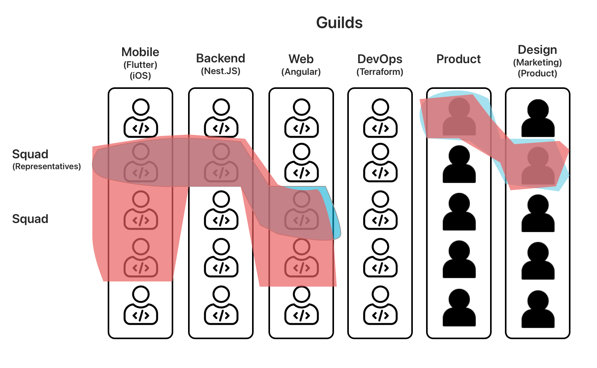

+++
title = "Squads & Guilds"
description = "Visual explainers of how we organize using Squads & Guilds"
date = 2021-05-01T18:20:00+00:00
updated = 2021-05-01T18:20:00+00:00
draft = false
weight = 420
sort_by = "weight"
template = "docs/page.html"

[extra]
toc = true
top = false
+++

At Uptech Studio we organize ourselves in a similar fashion to Spotify with Squads & Guilds. However how we define Squads & Guilds is a bit different.

## TLDR

Below is an explainer describing what Squads & Guilds are to us and some examples of how people fit into them.

## Squads

A **squad** is simply a group of people organized around delivering a particular project/product. They are **on the hook** as they are responsible for delivering the project/product to the client. Squads are formed and disbanded as needed around the various projects/products.

### Squad Representatives

Squad **representatives** are a subset of the Squad that is responsible for representing the various competencies to the client. Generally there is one person from each of the necessary competencies, e.g. Design, Engineering, Product. Squad Representatives are generally comitted for the lifetime of the project as they are the face of the squad to the client. If projects are long term we may shift representives around but generally try to minimize that.

## Guilds

A **guild** is a group of people focused on a particular competency, e.g. Dev-Ops, Mobile, Web, Backend, Product, Desktop, Data Engineering, Design. The following are things that guild members often help with.

- **helping** people do a certain task to hit deadlines. The assisting guild member bills their time against the project though.
- **pairing** with you if you are stuck, or need to be leveled up on a tool/concept. The helping guild member **should NOT** bill their time to the project.
- **peer review** the guild is responsible for helping you when you need a peer review and you don't have anyone with necessary competency in your Squad to do it. If you are doing the peer review, **bill your time** against the project.
- **manage time** being a Guild member you have obligations to get your own work done. You shouldn't be doing peer reviews & pairing for other projects non-stop. So manage your time and make sure you can meet your obligations.
- **sharing** you share your knowledge, tools, reusable code, best practices, etc. within the guild.
- **standards** you collaborate within the guild to define standards & best practices.
- **multiple guilds** you can be a member of more than one guild as you may have more than one competency.

Our primary communication mechanism for Guilds is **Slack Channels**, e.g. **#mobile-guild**, **#backend-guild**, etc.

## Why Squads & Guilds?

Basically we needed a way to facilitate making sure we were focusing and delivering for our clients (the focus of the Squad) while also facilitating cross-pollination and elimination of siloing across the organization (the focus of the Guild). We have found this structure and the intention behind it to be extremely effective on both these fronts.

Below you can see a visualization of what Squad might look like in relation to Guilds.

