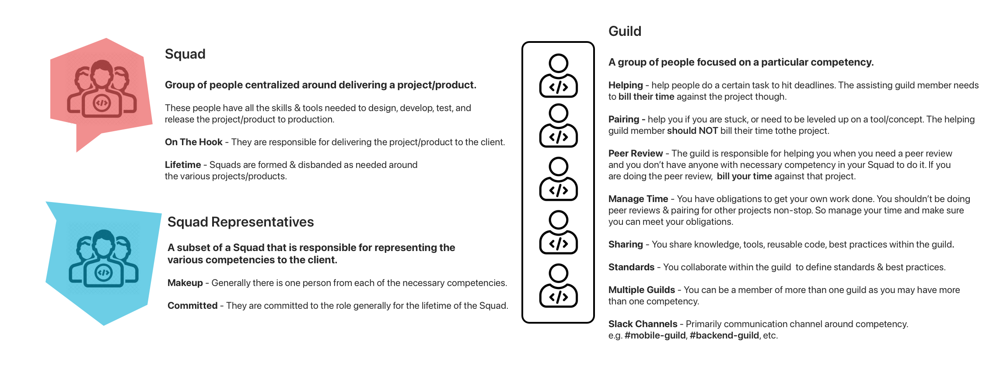
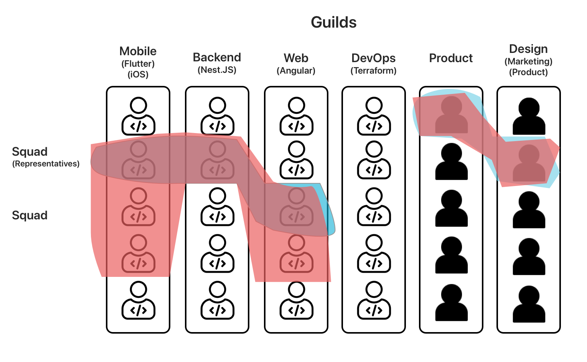

+++
title = "Squads & Guilds"
date = 2022-02-09 # or weight 
description = "Visual explainers of how we organize using Squads & Guilds here at UpTech Works, LLC"
insert_anchor_links = "right"

[taxonomies] #all taxonomies is optional
tags = ["process"]
authors = ["Squads & Guilds"]
+++

At UpTech Works, LLC we organize ourselves in a similar fashion to Spotify with Squads & Guilds. Below is an explainer describing what Squads & Guilds are to us and some examples of how people fit into them.

